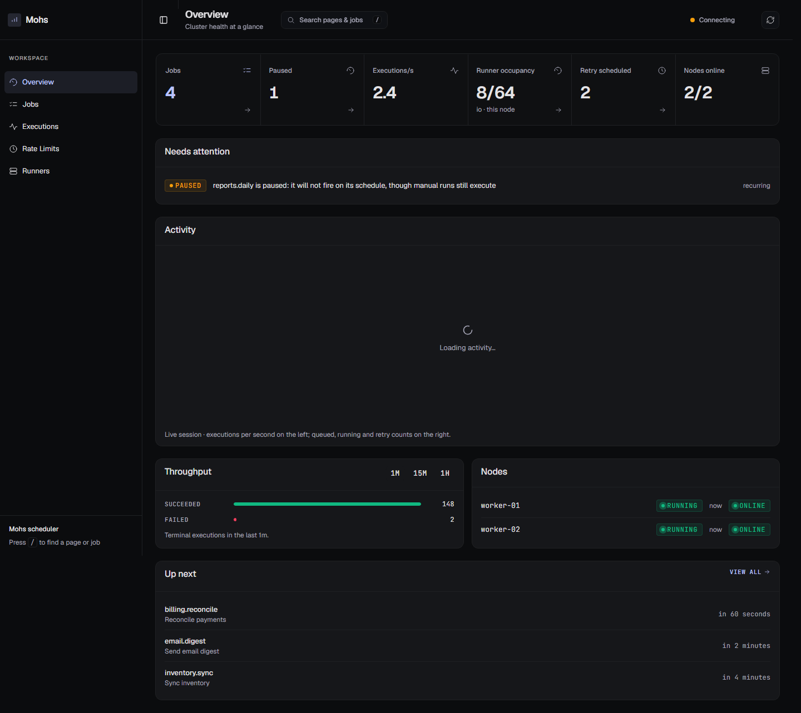
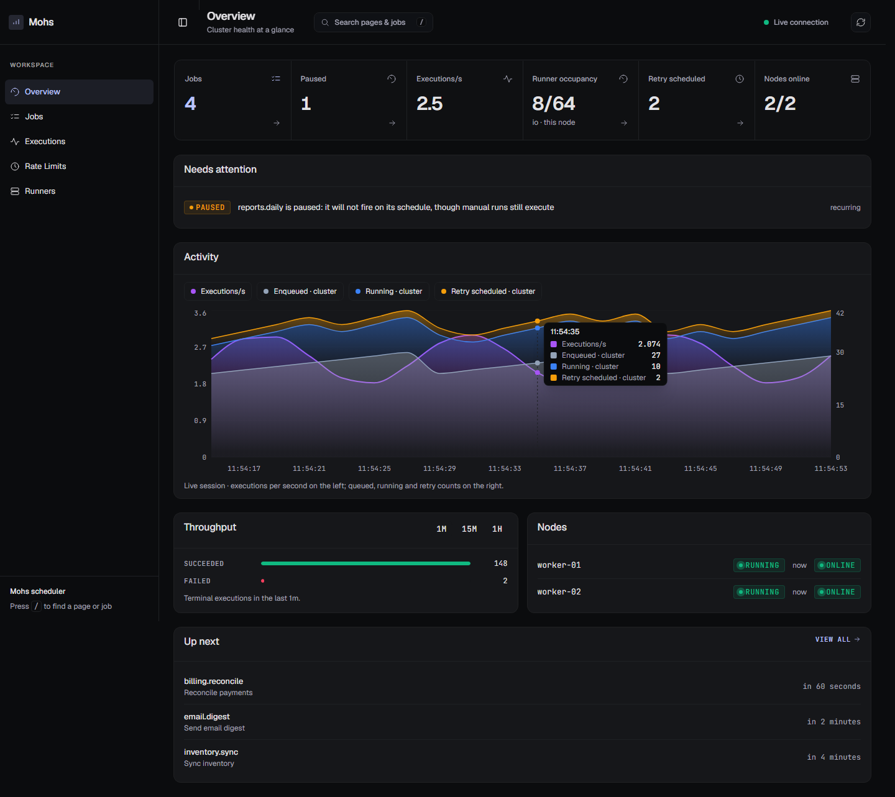
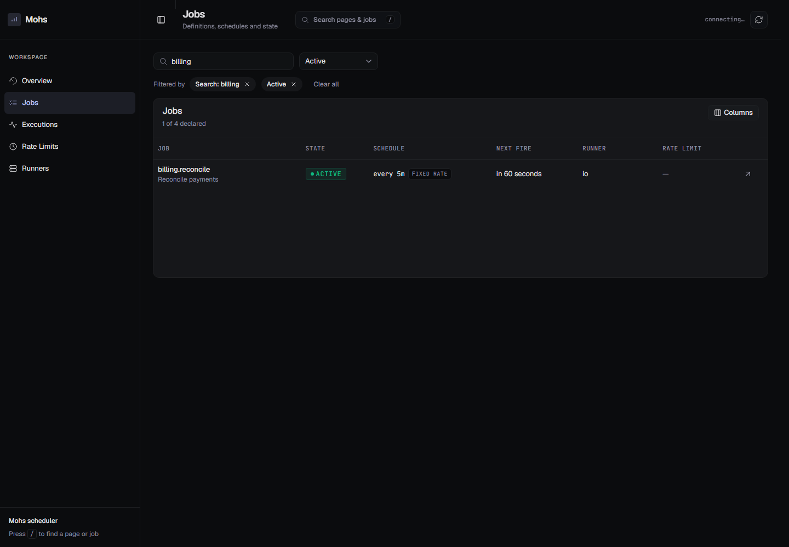
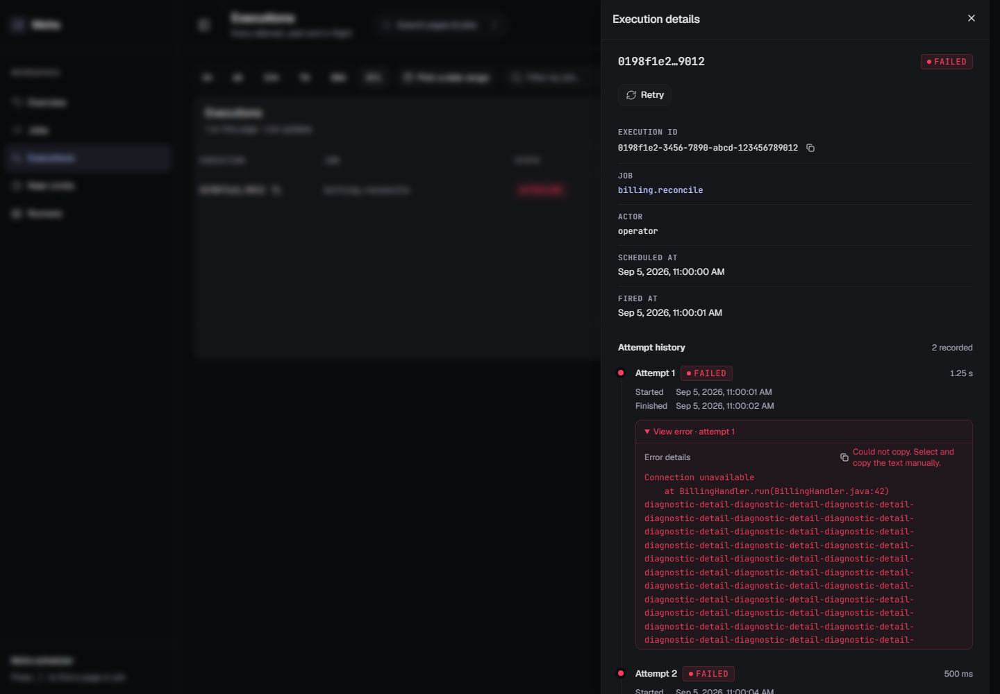
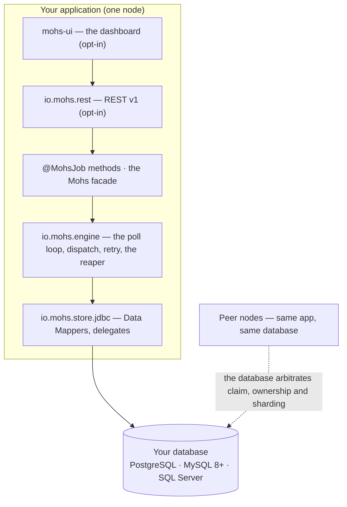

# Mohs

**Job scheduling for Java 25 and Spring Boot 4** — an embedded library, backed by your own relational
database, built for clustered deployments.

[](LICENSE)
[](https://openjdk.org/projects/jdk/25/)
[](https://spring.io/projects/spring-boot)

The name comes from the Mohs hardness scale.

[Getting started](docs/01-overview/getting-started.md) ·
[Documentation](docs/README.md) ·
[Dashboard guide](docs/13-operations/dashboard.md) ·
[API reference](docs/05-api/api-overview.md) ·
[Operations](docs/13-operations/README.md)

---

## What it is

Add one dependency, point a `DataSource` at a database, annotate a method:

```java
@Component
class Invoices {

    @RecurringJob(id = "nightly", cron = "0 0 3 * * *", zone = "America/Sao_Paulo", retries = 3)
    void nightly() { … }

    @OnDemandJob(id = "send-invoice", rateLimit = "smtp", timeout = "PT2M")
    void send(SendInvoice payload, JobContext ctx) { … }
}
```

```java
mohs.schedule(SEND_INVOICE, new SendInvoice(4711))
    .as("ops@acme.com")
    .idempotencyKey("invoice-4711")
    .now();
```

That is the whole surface for the common case. No `Job` interface, no `implements`, no serialisation
boundary.

## What it gives you

| | |
| --- | --- |
| **At-least-once delivery** | Guaranteed when `retries > 0` — which is the default, for exactly this reason |
| **Cluster-safe by construction** | No leader, no consensus, no lock service. Three database-arbitrated decisions: a CAS on the trigger, `SKIP LOCKED` on the claim, a fenced `DELETE` on the completion |
| **Automatic recovery** | A dead node's lease expires; a peer's reaper reclaims its work through the retry budget. A revived zombie's writes lose by construction — every owned write carries a `(node_id, epoch, attempt)` fencing token |
| **Four schedule kinds** | Seconds-first cron with Quartz extensions, fixed rate, fixed delay, on demand — with DST fall-back suppression and three misfire policies |
| **Cooperative cancellation** | Per-attempt timeouts, a shutdown drain with escalation, and an optional watchdog bound |
| **Idempotent invocation** | `Idempotency-Key` deduplication that composes with your transaction as a savepoint |
| **Batches** | All-or-nothing creation, atomic counting, exactly one `BatchCompleted` |
| **Cluster-wide rate limits and exclusion windows** | Token buckets and firing exclusions, referenced by name |
| **An operational REST API and dashboard** | Both opt-in, served on your server, inside your security |
| **Metrics out of the box** | `mohs.*` through Micrometer, always on |

## Operational dashboard

The optional dashboard turns the operational API into a focused workspace for understanding the
cluster and acting on it. It follows live throughput and queue state, highlights jobs that need
attention, preserves filters in shareable URLs and asks for confirmation before mutations.



The activity chart combines execution rate with queued, running and retrying work. Hovering reveals
the values at a point in time, and each series can be shown or hidden independently.



<table>
  <tr>
    <td width="50%">
      
    </td>
    <td width="50%">
      
    </td>
  </tr>
  <tr>
    <td align="center"><sub>Searchable jobs, active filters and configurable columns</sub></td>
    <td align="center"><sub>Execution metadata, attempt history and operational actions</sub></td>
  </tr>
</table>

The UI is served at `/mohs-ui` by the host application. It has no authentication layer of its own;
protect it and `/api/mohs/**` with the host security configuration. See the
[dashboard guide](docs/13-operations/dashboard.md) for navigation, live updates and action semantics.

## Quick start

For a complete walkthrough, see [Getting started](docs/01-overview/getting-started.md).

```xml
<dependencyManagement>
  <dependencies>
    <dependency>
      <groupId>io.github.robsonkades</groupId>
      <artifactId>mohs-bom</artifactId>
      <version>${mohs.version}</version>
      <type>pom</type>
      <scope>import</scope>
    </dependency>
  </dependencies>
</dependencyManagement>

<dependencies>
  <dependency>
    <groupId>io.github.robsonkades</groupId>
    <artifactId>mohs-spring-boot-starter</artifactId>
  </dependency>

  <!-- optional: the operational dashboard at /mohs-ui -->
  <dependency>
    <groupId>io.github.robsonkades</groupId>
    <artifactId>mohs-ui</artifactId>
  </dependency>
</dependencies>
```

```yaml
mohs:
  jdbc:
    dialect: postgresql     # the ONE mandatory property — never auto-detected
```

Everything else has a default — but **you install the schema before starting the application.** Mohs
executes no DDL: it never creates, alters or migrates a table. Apply `schema-<dialect>.sql`, which
ships inside `mohs-store-jdbc`'s jar:

```bash
psql -U postgres -d yourdb -f schema-postgresql.sql
```

Without it, the first write fails at boot with the driver's own message
(`relation "mohs_rate_limits" does not exist`). Upgrading an existing database means applying the
`V*.sql` deltas yourself — see [installing and upgrading the schema](docs/06-data/migrations.md).
An embedded library does not run DDL against a database it does not own.

## Architecture at a glance



Eleven Maven modules, ports and adapters, with the boundaries **executable by the reactor itself**:
`mohs-api` cannot see `mohs-engine`, and `mohs-rest` cannot see it either.

The hot path is split into four tables by **write profile**, so **history size does not affect claim
cost** — measured flat between roughly 0 and 2 M history rows.

## Technology

| | |
| --- | --- |
| Java 25, Spring Boot 4.1.1 (imported as a BOM, not inherited as a parent) | |
| PostgreSQL · MySQL 8.0+ · SQL Server in production; H2 for dev, with a boot WARN | |
| Jackson 3, Micrometer, SLF4J, JSpecify, UUIDv7 | |
| React 19 + TanStack + Tailwind for the dashboard | |
| **No** message broker, HTTP client, cloud SDK, cache or ORM | |

## Repository layout

```text
mohs-cron/                   seconds-first cron parsing, vendored, self-contained
mohs-api/                    THE PUBLIC API — 100% contract
mohs-engine/                 the engine and its ten ports (nine for persistence, one for the clock)
mohs-store-jdbc/             JDBC adapters, dialects, migrations
mohs-rest/                   the operational REST API v1
mohs-ui/                     the dashboard — no Java, only the built bundle
mohs-test/                   the test kit: MutableClock, InMemoryJobStore
mohs-spring-boot-starter/    the composition root
mohs-demo/                   a development application — never published
mohs-benchmark/              load and chaos harnesses — never published
mohs-bom/                    the bill of materials
docs/                        the documentation
```

## Build, test, run

```bash
./mvnw clean verify                     # everything, including the frontend
./mvnw verify -Dskip.frontend=true      # backend only — never for a published jar
./mvnw test -pl mohs-engine -Dtest=ShardsTest

./mvnw -pl mohs-demo -am spring-boot:run \
  -Dspring-boot.run.arguments="--mohs.api.enabled=true --spring.datasource.hikari.connection-timeout=3000"
```

**Docker is required** for `mohs-store-jdbc` and `mohs-benchmark` (Testcontainers). Without it,
container-backed tests fail on `Could not initialize class *TestSupport` — an environment failure, not
a regression.

## Documentation

**Full documentation: [`docs/`](docs/README.md)**

| If you are… | Start at |
| --- | --- |
| New to the project | [Getting started](docs/01-overview/getting-started.md) · [Product overview](docs/01-overview/product-overview.md) |
| Integrating Mohs | [Java API](docs/05-api/java-api.md) · [Configuration reference](docs/07-configuration/configuration-reference.md) |
| Operating it | [Dashboard](docs/13-operations/dashboard.md) · [Runbook](docs/13-operations/runbook.md) · [Troubleshooting](docs/13-operations/troubleshooting.md) · [Security](docs/08-security/security-overview.md) |
| Reviewing the design | [Architecture overview](docs/02-architecture/architecture-overview.md) · [Execution lifecycle](docs/02-architecture/execution-lifecycle.md) |
| Contributing | [Local development](docs/14-development/local-development.md) · [Contributing](docs/14-development/contributing.md) |

## Two things to read before production

1. **The REST API has no authentication.** It is off by default, and enabling it logs a WARN naming
   exactly what it can do. Put a `SecurityFilterChain` in front of `/api/mohs/**`, `/mohs-ui` and
   `/mohs-ui/**`.
   See [security](docs/08-security/security-overview.md).
2. **History retention is opt-in.** `mohs_execution`, `mohs_attempt` and `mohs_batches` grow
   forever unless you set `mohs.engine.history-retention` (default `0s`, meaning keep everything);
   with a window the engine sweeps terminal history hourly. `mohs_idempotency` is bounded separately
   by `mohs.engine.idempotency-retention` (default `7d`) — which is the deduplication window itself,
   not just housekeeping. See [data lifecycle](docs/06-data/data-lifecycle.md).

## Status

Version `0.0.1-SNAPSHOT` — **no released artefact yet**, but the release pipeline exists
(`.github/workflows/release.yml`, signed, to the Central Portal), and CI runs the full build on
push to `main` and pull requests targeting it. See the [documentation](docs/README.md) for usage
and operational requirements, and [CHANGELOG.md](CHANGELOG.md) for the changes in this checkout.

Contributing: [CONTRIBUTING.md](CONTRIBUTING.md) · Security: [SECURITY.md](SECURITY.md)

## Licence

Apache 2.0 — see [LICENSE](LICENSE).

`io.mohs.cron` is adapted from `org.springframework.scheduling.support` (Apache 2.0); the adaptation
and its one functional divergence are recorded in [NOTICE](NOTICE), which is packaged into every jar's
`META-INF`.
