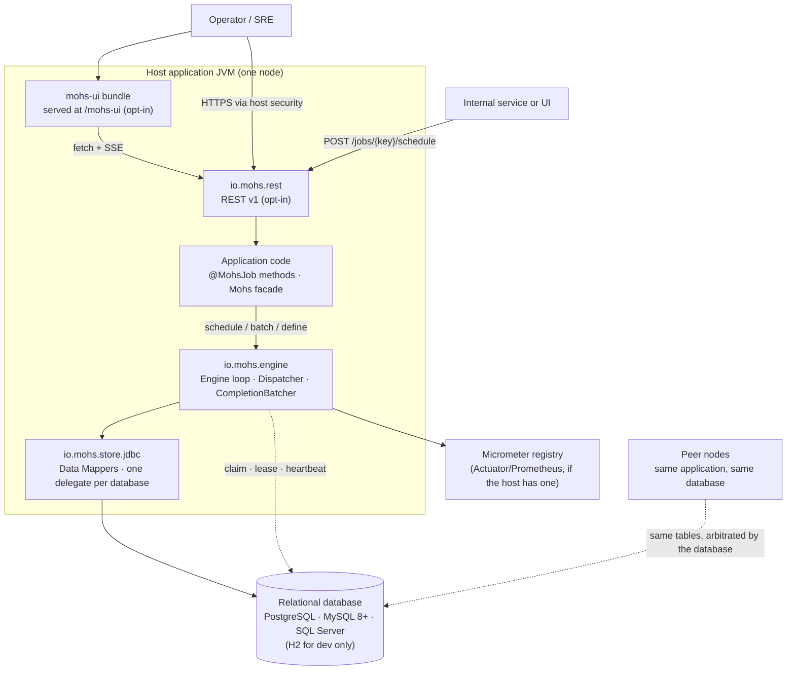
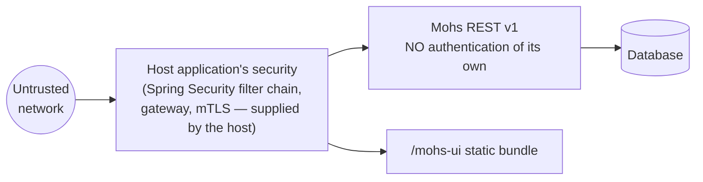

# System context

Status: Active · Last Reviewed: 2026-09-05 · Source of Truth: Repository

## The shape of a Mohs deployment

Mohs has no process of its own. It runs **inside** the host application's JVM, on the host's
`DataSource`, on the host's web server. Each node has a platform thread named `mohs-engine-loop`, bounded job runners,
completion flushing and event publication. The optional REST stream adds its own
snapshot scheduler. See the [thread inventory](../04-engineering/concurrency.md#thread-inventory).

## Actors

| Actor | Interacts through | Notes |
| --- | --- | --- |
| **Application developer** | `@MohsJob` methods, the `Mohs` facade, `ExecutionListener`/`ExecutionInterceptor` beans | The primary user. Never touches the engine or the store packages — the reactor enforces it: `mohs-api` has neither on its compile classpath. |
| **Operator / SRE** | REST v1 and the `/mohs-ui` dashboard | Pause/resume jobs, cancel and retry executions, adjust rate limits, inspect nodes and runners. |
| **Another internal service** | `POST /jobs/{jobKey}/schedule` with an optional `Idempotency-Key` | Fire-and-forget invocation of an on-demand job. |
| **The engine itself** | Writes with `actor = "scheduler"` | A reserved actor name; `ScheduleCommand.as` and `HeaderActorResolver` both reject it so a manual schedule can never impersonate a trigger. |

## External systems

There is exactly **one** external dependency at runtime: the relational database.

| System | Protocol | Purpose | Configuration | Failure behaviour |
| --- | --- | --- | --- | --- |
| Relational database | JDBC (host's `DataSource`) | All durable state: definitions, queue, ownership, history, batches, rate-limit buckets, node registry | `mohs.jdbc.dialect` (mandatory, never auto-detected). The schema is installed by the operator; Mohs runs no DDL | The tick logs and backs off; maintenance steps are isolated so one failing step does not stop the claim; ownership stands until a reaper reclaims it |
| Micrometer registry | In-process | `mohs.*` metrics | None; a local `SimpleMeterRegistry` is used when the host has no registry | Never affects execution |

**No message broker, no HTTP client, no cloud SDK, no cache server** appears anywhere in the
reactor's dependency tree. This was verified against every module `pom.xml`.

## Node identity and clustering

- A **node** is one JVM running the engine. Its `nodeId` is a UUIDv7 generated fresh at every
  construction of `Engine` — a restart is a new node, never a resumed one.
- Nodes discover each other only through the `mohs_nodes` table. There is no gossip, no registry,
  no leader.
- The database is the arbiter for every contended decision: firing a trigger (a CAS), claiming an
  execution (`SKIP LOCKED` inside a transaction), and completing one (a fenced `DELETE`).

## Trust boundaries

The critical fact: **`io.mohs.rest` performs no authentication and no authorization.** The only
identity concept is the `X-Mohs-Actor` header, which is *declarative attribution for the audit
trail*, not a credential. Turning `mohs.api.enabled=true` logs a WARN naming exactly what the API
can do. See [security overview](../08-security/security-overview.md).

## Deployment shape

The repository contains no deployment manifests. GitHub Actions workflows build, test and
release the library; they do not deploy a running scheduler service. Mohs is packaged as jars and inherits the host application's deployment entirely.

What the code *does* assume about the runtime environment:

- **Rolling updates are expected.** `MohsEngineLifecycle` is a `SmartLifecycle` that starts last and
  stops first; `Engine#stop(grace)` drains in-flight work; `RollingUpdateScenario` in
  `mohs-benchmark` exercises a deploy where part of the cluster lacks a handler.
- **Parallel replica start is expected, and no longer races over the schema.** Replicas apply
  nothing: the schema is in place before any of them starts. The ordering that used to need a
  migration lock is now a step of your deploy — see
  [installing and upgrading the schema](../06-data/migrations.md).
- **`terminationGracePeriodSeconds` must exceed `mohs.lifecycle.shutdown.grace-period`** (default
  30 s) plus the web server's own graceful-shutdown phase. See
  [startup and shutdown](../13-operations/startup-and-shutdown.md).
