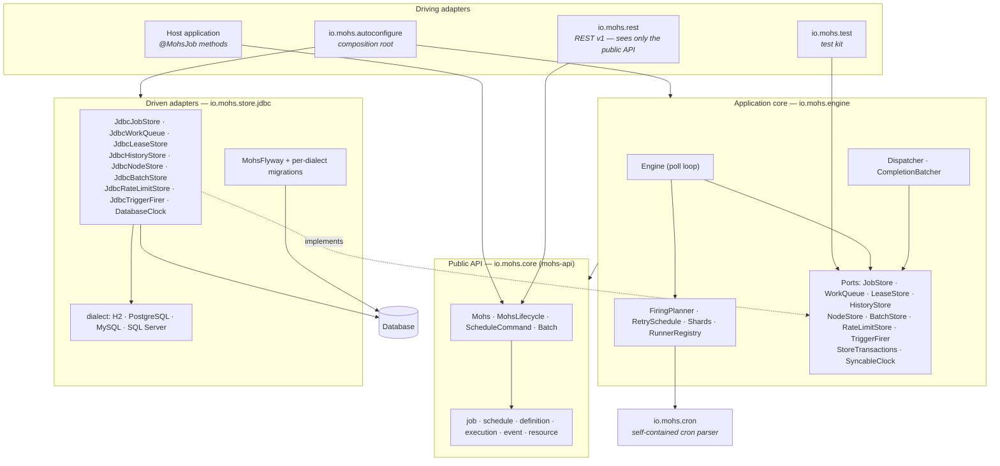

# Architecture overview

Status: Active · Last Reviewed: 2026-08-29 · Source of Truth: Repository

## Architectural style, and the evidence for it

Mohs is a **modular library with a ports-and-adapters (hexagonal) core**, packaged as a multi-module
Maven reactor. That classification is not a label applied from outside — it is directly observable:

| Hexagonal element | Where it is in Mohs | Proof it is real |
| --- | --- | --- |
| **Domain / contracts** | `io.mohs.core` (module `mohs-api`): records, sealed interfaces, plain interfaces. No wiring. | `mohs-api`'s only dependency is `spring-core`, for `@AliasFor` and `@CheckReturnValue`. It cannot see the engine. |
| **Application core** | `io.mohs.engine` (module `mohs-engine`): the `Engine` loop, `Dispatcher`, `MohsImpl`. | Depends on `mohs-api` and `mohs-cron` only. |
| **Driven ports** | `JobStore`, `WorkQueue`, `LeaseStore`, `HistoryStore`, `NodeStore`, `BatchStore`, `RateLimitStore`, `TriggerFirer`, `StoreTransactions`, `SyncableClock` — all interfaces in `io.mohs.engine` | The `engine_is_free_of_jdbc` ArchUnit rule forbids `java.sql`/`javax.sql` types from appearing anywhere in the engine, including port signatures. |
| **Driven adapters** | `io.mohs.store.jdbc` (module `mohs-store-jdbc`): one `Jdbc*` class per port, plus `dialect/`. | The reactor's dependency direction is store → engine; the inverse cannot compile. |
| **Driving adapters** | `io.mohs.rest` (REST v1), `io.mohs.autoconfigure` (Spring wiring), `io.mohs.test` (test kit) | `rest_only_sees_public_api` forbids `io.mohs.rest` from depending on the engine or the store. |
| **Composition root** | `io.mohs.autoconfigure` (module `mohs-spring-boot-starter`) | The *only* package allowed to depend on internals, and the only one allowed to speak `org.springframework.boot.autoconfigure` (`only_the_starter_speaks_boot_autoconfigure`). |

What it is **not**:

- Not layered-by-technical-role. There is no `service`/`repository`/`controller` split inside a
  module; packages are cut by *concept* (queue, ownership, history, control).
- Not microservices. One reactor, one process, one database.
- Not event-sourced. `mohs_execution` holds current state plus an append-only attempt log; there is
  no event store and no replay-to-rebuild.
- Not CQRS in the strict sense — although it does have a **derived read model** (see below), which
  is the one place the write model and the read model deliberately differ.

## The layer diagram

## Dependency rules

The rules are **executable in two independent ways**, which is the reason they hold:

1. **By the reactor.** `mohs-api` does not have `mohs-engine` on its compile classpath, so the
   public API physically cannot reference the engine. Similarly `mohs-engine` does not have
   `mohs-store-jdbc`.
2. **By ArchUnit**, in `mohs-demo/src/test/java/io/mohs/ArchitectureTest.java` — `mohs-demo` is the
   one module that sees every other module on a single classpath, which is what makes a
   whole-system rule checkable at all.

| Rule | Statement |
| --- | --- |
| `internal_packages_do_not_leak_into_public_api` | Nothing outside the five known internal packages may depend on `io.mohs.engine` or `io.mohs.store.jdbc`. The rule lists the *internal* packages (stable) rather than the public ones (growing), so a new public subpackage cannot silently escape it. |
| `rest_only_sees_public_api` | `io.mohs.rest` may not depend on the engine or the store. This is why the `Mohs` facade carries read methods it would not otherwise need. |
| `engine_is_free_of_jdbc` | No `java.sql` or `javax.sql` type may appear in the engine — including in a port signature. |
| `test_kit_does_not_leak_into_production` | Nothing outside `io.mohs.test` may depend on it. |
| `only_the_starter_speaks_boot_autoconfigure` | Only `io.mohs.autoconfigure` (plus the demo bootstrap, named explicitly) may reference Spring Boot autoconfiguration. |
| `core_subpackages_are_free_of_cycles` | The `io.mohs.core.*` subpackage graph is acyclic. |
| `rest_subpackages_are_free_of_cycles` | Same, for `io.mohs.rest.*`. |

A separate, module-local scan lives in
`mohs-store-jdbc/src/test/java/io/mohs/store/jdbc/TerminalStateWriteScanTest.java`: it reads its own
module's `src/main/java` to guard where terminal-state writes may occur.

## Dependency-direction findings

Analysed across every module `pom.xml` and package `package-info.java`:

- **No circular module dependencies.** The reactor order is
  `mohs-cron → mohs-api → mohs-engine → mohs-store-jdbc → mohs-rest → mohs-ui → mohs-test →
  mohs-spring-boot-starter → mohs-demo → mohs-benchmark → mohs-bom`.
- **One intentional test-scope back-edge**: `mohs-store-jdbc` depends on `mohs-test` at test scope
  only, and `mohs-test` depends on `mohs-engine` at compile scope. No compile cycle results.
- **Tests deliberately placed outside their module**: `mohs-store-jdbc/src/test` contains
  `io.mohs.engine.EngineTest`, `DispatcherTest`, `CompletionBatcherTest` and
  `ScheduleCommandImplTest`; `mohs-test/src/test` contains `io.mohs.engine.MohsImplTest`. These are
  engine tests that need a real store, and they live where the store is. Documented as a deliberate
  placement, not a leak — the production code does not move.
- **No architectural violations detected** beyond the items recorded in
  [technical debt](../technical-debt.md).

## Two structural ideas that explain most of the design

### 1. The write path is split by write profile, not by entity

Four tables exist because four *shapes of write* exist, and mixing them made the hottest table pay
for the coldest:

| Table | Write profile |
| --- | --- |
| `mohs_ready` | INSERT on enqueue/retry/requeue, DELETE on claim. Size = backlog. |
| `mohs_lease` | INSERT on claim, DELETE on completion. Size = work currently executing across the cluster (`nodes × dispatch-concurrency`). |
| `mohs_execution` | One INSERT at birth, one UPDATE at terminal. Grows forever. |
| `mohs_attempt` | Append-only. Grows forever. |

The consequence that matters operationally: **history size does not affect claim cost**, because the
claim statement references only `mohs_ready` and `mohs_lease`. This is asserted by a benchmark gate
(`ScenarioCluster`-based measurement recorded 2026-08-22: throughput flat between ~0 and 2 M history
rows).

### 2. The read model derives state rather than trusting a column

`mohs_execution.state` is **advisory**: it says `PENDING` from birth until a terminal write. Reads
that need the truth join the queue and the lease:

| Observed | Derived state |
| --- | --- |
| A lease row exists | `RUNNING`, with `owner` = the owning node and `firedAt` = the claim instant |
| A queue row with `attempt > 1` and `visible_at > now` | `RETRY_WAITING` |
| Any other queue row | `ENQUEUED` |
| A terminal value in the column | Itself (`SUCCEEDED` / `FAILED` / `CANCELLED`) |
| `PENDING` with neither queue nor lease | `ENQUEUED` — the bounded, documented staleness window of a completion flush in progress |

This is what lets the dashboard read a cheap column while correctness-critical paths read the truth.

## Cross-cutting invariants

These hold everywhere and are worth internalising before reading any other document:

1. **Every "when" comes from an injected `Clock`.** Reading `Instant.now()` or
   `System.currentTimeMillis()` in the engine or the store is an ArchUnit failure. The single named
   exception is `DatabaseClock`, where reading the real clock *is* the class's purpose.
2. **Every duration uses `System.nanoTime()`.** Monotonic time for elapsed measurement; wall-clock
   only for absolute deadlines.
3. **Every generated primary key is UUIDv7.** No `IDENTITY`, `SERIAL`, `AUTO_INCREMENT`, `SEQUENCE`,
   and no `UUID.randomUUID()` (the latter enforced by ArchUnit, including method references).
4. **Non-null is the default.** Every production package carries `@NullMarked`; an ArchUnit test
   fails the build if a package lacks it.
5. **No unbounded queue or unbounded wait.** Every executor has an explicit ceiling and rejects
   above it; every wait has a deadline.
