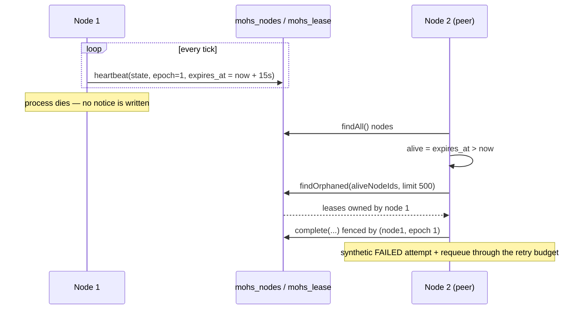
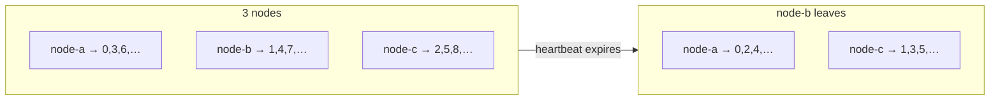

# Clustering and liveness

Status: Active · Last Reviewed: 2026-08-29 · Source of Truth: Repository

Mohs clusters without a coordinator. There is no leader election, no consensus protocol, no
membership service. Every contended decision is arbitrated by the database, and every node's role is
*derived* from data it can read.

## Node identity

| Fact | Value | Where |
| --- | --- | --- |
| `nodeId` | A UUIDv7 generated when `Engine` is constructed | `Engine` constructor |
| Lifetime | One JVM run. A restart is a **new node**, never a resumed one | Same |
| `epoch` | Starts at 1; rises only when the node itself observes that its own lease had expired | `Engine#renewNodeLease` |
| Registration | `mohs_nodes` upsert, once per tick | `NodeStore#heartbeat` |

## Liveness: the node lease

Each tick, before anything else, the node writes:

```
mohs_nodes(node_id, state, last_heartbeat_at = now, epoch, expires_at = now + node-lease-ttl)
```

That `expires_at` is a **promise**: "I am alive until here." It is the sole liveness authority.



Three properties of this design:

1. **Death is never written.** A crash produces no record. "Alive versus dead" is derived at read
   time from the age of the promise. `STOPPED` is the only self-reported outcome, written by the
   final heartbeat of a graceful shutdown — which is what makes a clean stop distinguishable from a
   crash in the database.
2. **Liveness is per node, not per execution.** An earlier design renewed a lease per execution, at
   roughly five updates per execution on the hottest table. Now it is one write per node per tick.
3. **Self-diagnosis is symmetric with a peer's judgement.** `renewNodeLease` treats
   `now >= expires_at` as expiry — using `!isBefore` rather than `isAfter` — because a peer's
   predicate considers the node dead already at equality. At the exact instant of expiry, both sides
   must agree.

### Configuration

| Property | Default | Role |
| --- | --- | --- |
| `mohs.engine.node-lease-ttl` | `15s` | The promise's length. Recovery latency after a crash has this as its floor |
| `mohs.engine.lease-ttl` | `30s` | Feeds the claim; also the staleness cutoff for a legacy node row with no `expires_at` (mixed-version tolerance) |
| Effective tick cadence | `min(sleep, node-lease-ttl / 3)` | The heartbeat rides on the tick, so the tick cannot be slower than the promise allows |
| Heartbeat-row retention | `node-lease-ttl × 10` | `purgeStaleNodeRows`. Not death detection — just collecting rows no reader can use, since each boot creates a new `node_id` |

## Fencing: `(node_id, epoch)`

Every write over owned work carries the pair. The completion is a fenced `DELETE`:

```sql
DELETE FROM mohs_lease
 WHERE execution_id = :id AND node_id = :nodeId AND epoch = :epoch
```

The row count *is* the verdict. A result whose delete affected zero rows belonged to a lost
incarnation: **nothing is written and no event is published**, and a WARN records the discard.

This is the classic fencing token. It closes the zombie scenario end to end:

```mermaid
sequenceDiagram
    participant N1 as Node 1 (stalls)
    participant DB as Database
    participant N2 as Node 2

    N1->>DB: claim → lease(exec, node1, epoch 1)
    Note over N1: GC pause / freeze longer than node-lease-ttl
    N2->>DB: reaper: lease owner node1 is not alive
    N2->>DB: complete fenced by (node1, epoch 1) → DELETE succeeds
    N2->>DB: requeue exec (attempt + 1)
    N2->>DB: claim → lease(exec, node2, epoch 1)
    Note over N1: resumes; renewNodeLease sees expiry → epoch := 2
    N1->>DB: complete fenced by (node1, epoch 1) → DELETE affects 0 rows
    Note over N1: result discarded, WARN logged, no event published
```

The epoch bump is what makes the zombie lose **all** its writes, not merely the reclaimed one.
`ArchitectureTest`-independent evidence: the `SUSPEND` scenario in `scripts/chaos-recovery.ps1`
asserts zero executions with more than one `SUCCEEDED` attempt.

## Sharding

`Shards.of(executionId) = FNV-1a(utf8 bytes) mod 64`.

| Property | Value | Reason |
| --- | --- | --- |
| Shard count | **64, fixed, not configurable** | 64 divides cleanly into any plausible node count, and 64 shards on a single node cost nothing |
| Hash | FNV-1a, **never `String.hashCode()`** | A shard written by one JVM must be re-derivable by any other, forever. That stability is contract, pinned by literal values in `ShardsTest` |
| Storage | The `shard` column exists in `mohs_ready` but is a **function of the id**, not transported state | Enqueue, retry, requeue and the reaper all re-derive the same value with no column in `mohs_lease` and no migration |
| Validation | The range `[0, 64)` is checked in `WorkQueue.ReadyEntry`'s compact constructor | A row outside the range would never be claimed — no node's derived partition probes it — and would rot in the queue silently |

**Changing the hash function would require a data migration, not a refactor**: entries already in
the queue would sit in shards nobody re-derives the same way.

### Assignment

Derived, never negotiated (`Shards.ownedBy`):

1. Take the live, `RUNNING` node ids.
2. Sort them (on a copy, so callers may pass any order).
3. Find your own index `i` out of `n`.
4. Own `{ s : s mod n == i }`.



Two safety properties:

- **Disagreement is bounded and self-healing.** During a membership change two nodes may disagree
  for one heartbeat. The overlap degrades to exactly the pre-shard behaviour — `SKIP LOCKED`
  resolves it — and heals within one heartbeat.
- **A node outside the set owns everything.** A node that has just joined and does not yet see
  itself in the read owns *all* shards. A temporary overlap is the pre-shard behaviour; "owning
  nothing" would stall the queue.

Eligibility is **alive AND `RUNNING`**. `PAUSED`/`DRAINING`/`STOPPED` nodes do not claim, so giving
them shards would leave 1/n of the queue stalled while their peers had headroom.

### The "owns no shard" condition

If a cluster has more `RUNNING` nodes than shards (more than 64), `Shards.ownedBy` returns an empty
list and that node never claims. This is logged **once per transition**, not once per tick — at a
25 ms floor it would be ~40 lines/s per node, burying everything else:

> `this node owns no shard of 64 — it will never claim. The cluster has more RUNNING nodes than
> shards; reduce the node count or raise Shards.SHARD_COUNT.`

## The reaper

`Engine#reapOrphanedLeases`, one step of the tick:

1. `leaseStore.findOrphaned(aliveNodeIds, RECLAIM_LIMIT = 500)` — leases whose owner is not in the
   live set, oldest `claimed_at` first. **A node absent from `mohs_nodes` is dead by definition.**
2. `historyStore.findHeads(ids)` — headers only; the reaper's cold path does not pay for payload
   deserialisation.
3. For each orphan, decide (`decideReclaim`):

| Condition | Outcome |
| --- | --- |
| `cancel_requested` was already set | Terminal `CANCELLED`. The operator's order beats the budget |
| Job retired | Terminal `FAILED` — a rescheduled entry would never be claimed |
| Retry budget remains | Synthetic `FAILED` attempt (`node lease expired — node presumed dead`) **plus** a queue entry with `attempt + 1`, in the same transaction |
| Budget exhausted | Terminal `FAILED` with `attemptsExhausted = true` |

4. `leaseStore.complete(...)` — all decisions in one fenced transaction.
5. For each fence winner: record `mohs.lease.reclaimed{reason}` and publish the same events the
   dispatch path would (`AttemptFailed` + `RetryScheduled`, or `Cancelled`, or `Failed`).

The 500-per-tick cap exists so a mass node death does not become one transaction with unbounded
locks; the surplus drains over following ticks, oldest first.

**The `nodeIdsMatching` invariant**: the live list *always* includes this node, appended if absent.
That, combined with the heartbeat running **before** the reaper in the same tick, is what kills
self-reaping.

## The stray-lease reconcile

The reaper cannot help a node that is alive. `reconcileOwnStrayLeases` covers work lost *inside*
this node — between the claim and the dispatch: a failed payload query, an executor rejection, a
terminal-failure write that threw. Without it the only remedy would be restarting the node, which is
a liveness violation: every ownership needs a reachable expiry path.

Three guards, in the order state → state → time, because at high throughput the normal case is a
completion **in transit** inside the `CompletionBatcher`:

| Guard | Skips the lease when |
| --- | --- |
| In-flight map | `inFlightAttempts` contains the id |
| Batcher transit | `dispatcher.completionInTransit(id)` — covers a job running longer than the grace |
| Grace on `claimed_at` | `claimed_at > now − max(2s, 4 × poll-interval)` |

Plus a fourth: a candidate must be absent for **two consecutive rounds** before being requeued.

The 2-second floor is not theoretical. During a benchmark cold start (JIT and warm-up) the flusher
fell more than 500 ms behind and the reconcile requeued whole batches of completions in transit —
blocks of 256 and 512, 10,700 lost fences in one cold round. An earlier version without the grace
produced 199,000 WARNs and phantom requeues that contended with the flush until deadlock.

The cost is bounded: a legitimate orphan waits the grace plus two rounds — about 2 s at a 20 ms
poll, about 30 s at the 5 s poll — never worse than the per-execution lease era's 30 s.

## Failure detector characteristics

Summarised in the standard vocabulary:

| Property | Value |
| --- | --- |
| Detector type | Lease/heartbeat with a promise, evaluated at read time |
| Completeness | Strong — a crashed node's promise always expires |
| Accuracy | Not perfect. A node stalled longer than its TTL is falsely suspected. **Mitigated, not prevented**: the false suspicion is safe because the fence discards the zombie's writes |
| Detection latency | Between 0 and `node-lease-ttl`, plus up to one tick of the detecting peer |
| Recovery latency floor | `node-lease-ttl` (15 s by default) — a measured chaos run recorded a reclaim wave 15.4 s after a `kill -9`, with the whole recovery finished at 19.6 s |
| Clock assumption | Wall-clock comparison across nodes. A backwards jump between heartbeats is **detected and logged** with its consequence, naming NTP and `mohs.time.mode` as the things to check |

## The database-synced clock

For clusters where host clocks are not trustworthy, `mohs.time.mode=database` swaps the injected
`Clock` for `DatabaseClock`:

- `sync()` samples `SELECT CURRENT_TIMESTAMP` with round-trip compensation (the midpoint of the
  request), computes the offset, and applies a **monotonic clamp** — a sample that would move time
  backwards is discarded rather than adjusted, and retried next time.
- `instant()` never performs I/O: it is `systemClock.instant() + offset`, O(1).
- The clamp uses `accumulateAndGet`, so the comparison and the write are one unit regardless of who
  calls `sync()`.
- A first synchronous sync happens at boot, deliberately blocking — the engine must not start with
  an unsynchronised clock — and then `mohs.time.sync-interval` (30 s) schedules the resync.

**Known gap**: on SQL Server, `CURRENT_TIMESTAMP` is a zoneless `DATETIME` interpreted in the JVM's
zone. Recorded in `DatabaseClock#sync`'s comments; see [technical debt](../technical-debt.md).

## Cluster-wide mutual exclusion, in full

There are exactly three, and none of them is a lock service:

| Decision | Mechanism | Loser's behaviour |
| --- | --- | --- |
| Who fires a due trigger | `UPDATE … SET next_fire_at = :new WHERE next_fire_at = :observed` | Returns `false` and moves on. Routine, not an error |
| Who runs a queued execution | `SELECT … FOR UPDATE SKIP LOCKED` inside the claim transaction | Never sees the row |
| Whose completion counts | `DELETE mohs_lease WHERE (execution_id, node_id, epoch)` | Row count 0 → result discarded with a WARN |

Because trigger advance and occurrence insert are **atomic**, a crash between them can neither lose
nor duplicate an occurrence — which is why occurrences carry no `Idempotency-Key` (that key would be
subject to a retention window).
