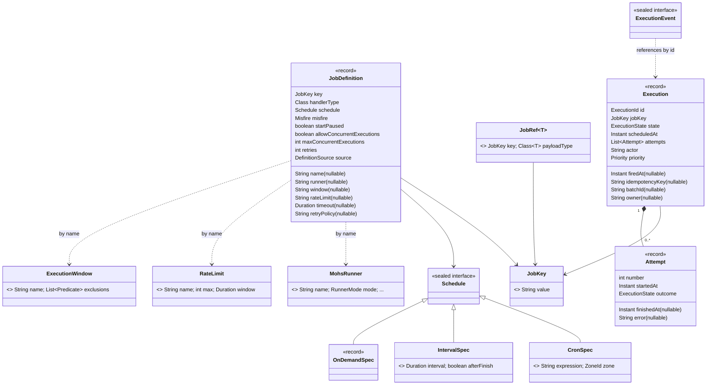

# Domain model

Status: Active · Last Reviewed: 2026-08-29 · Source of Truth: Repository (`mohs-api/src/main/java/io/mohs/core`)

The domain is expressed almost entirely as Java records and sealed interfaces. Validation lives in
compact constructors, so an invalid domain object cannot exist.

## Model overview

## Aggregates

Mohs has **two** aggregates in the DDD sense, and they are deliberately decoupled.

### Aggregate 1: the job definition

- **Root**: `JobDefinition`, identified by `JobKey`.
- **Consistency boundary**: one row in `mohs_job_definitions`.
- **Written by**: `JobStore#upsert` (the definitional part) and the narrow operational writers
  (`pause`, `resume`, `markOrphaned`, `remove`, `armNextFire`, `reschedule`).
- **Key invariant**: definitional and operational state are separated. An upsert writes what the
  code declares and **never** touches `paused`, `orphaned` or `next_fire_at` — with exactly two
  documented exceptions: the upsert clears `orphaned` (the source reappearing is proof of life),
  and *only on the first registration* initialises `paused = startPaused`.
- **Another key invariant**: preserving `next_fire_at` means **not writing the column**, never
  rewriting the value that was read. Rewriting would be a lost update against the firing CAS and
  against the completion's rearm.

Record-level invariants, enforced in the compact constructor:

| Invariant | Message |
| --- | --- |
| `allowConcurrentExecutions == true` ⇒ `maxConcurrentExecutions == 0` | `maxConcurrentExecutions must be 0 when allowConcurrentExecutions is true` |
| `allowConcurrentExecutions == false` ⇒ `maxConcurrentExecutions >= 1` | `maxConcurrentExecutions must be at least 1 when allowConcurrentExecutions is false` |
| `retries >= 0` | `retries must not be negative` |
| `timeout` positive when present | `timeout must be positive` |
| `runner`, `window`, `rateLimit`, `retryPolicy` non-blank when present | `<field> must not be blank` |

### Aggregate 2: the execution

- **Root**: `Execution`, identified by `ExecutionId` (UUIDv7).
- **Consistency boundary**: physically spread across `mohs_execution`, `mohs_attempt`,
  `mohs_ready` and `mohs_lease` — but every transition that spans them happens **in one
  transaction**. This is the one place where the aggregate is not one table, and it is intentional:
  the split is by write profile.
- **Written by**: the enqueue unit (`HistoryStore#record` + `WorkQueue#offer`), the claim
  (`WorkQueue#claim`), and the completion (`LeaseStore#complete`).
- **Key invariant**: an execution is never simultaneously "neither queued nor owned". The claim
  transaction removes the queue entry and inserts the lease atomically.
- **Key invariant**: a completion result is *either* terminal *or* carries a retry entry, never
  both and never neither. Enforced in `LeaseStore.CompletionResult`'s compact constructor.

Record-level invariants on `Attempt`:

| Invariant | Rationale |
| --- | --- |
| `number >= 1` | Attempts are 1-based |
| `outcome` may not be `ENQUEUED` or `RETRY_WAITING` | Those describe the owning execution's state, not one attempt's result |
| `error != null` **iff** `outcome == FAILED` | An error without a failure, or a failure without an error, is a modelling bug |

## Value objects

| Value object | Invariant | Notes |
| --- | --- | --- |
| `JobKey(String value)` | non-null, non-blank | Static factory `of` preferred over the constructor: it reads as a conversion at the call site |
| `ExecutionId(String value)` | non-null, non-blank | Opaque by contract; the engine chooses the format (UUIDv7) |
| `JobRef<T>(JobKey, Class<T>)` | both non-null | The only compile-time payload safety in the API |
| `CronSpec(expression, zone)` | both non-null, expression non-blank | The zone is **mandatory** — never the JVM default |
| `IntervalSpec(interval, afterFinish)` | interval strictly positive | |
| `MohsRunner` | mode-dependent: IO fields must be zero on a CPU runner and vice versa | One flat record rather than one sealed type per mode; ergonomics come from the two builders |
| `RateLimit(name, max, window)` | `max >= 1`, `window` positive, and `window >= max` nanoseconds | The last clause stops `window.dividedBy(max)` truncating to zero — a division by `Duration.ZERO` inside the claim would bring down the entire round, including jobs with no limit |
| `ExecutionWindow(name, exclusions)` | name non-blank; exclusions defensively copied | **Equality is effectively identity**: `exclusions` holds lambdas, so two windows built from identical calls are never `equals()`. Documented, not accidental |
| `Priority` | five levels with an explicit `value()` weight | The weight is an instance field, never `ordinal()`; lower claims first |
| `ThroughputReading(window, succeeded, failed)` | window positive, counters non-negative | `perSecond()` avoids `toNanos()` overflow above ~292 years of window |

## Domain events

`ExecutionEvent` is a **sealed** interface with exactly eight permitted variants, so a listener can
pattern-match exhaustively and a new variant becomes a compiler warning rather than a silent
`default` branch.

| Event | Carries | Published when |
| --- | --- | --- |
| `Enqueued` | `executionId`, `jobKey`, `scheduledAt`, `actor` | An execution is accepted. **Dual role**: it is also the receipt returned by `ScheduleCommand`'s terminals. Published to the listeners once the enqueue is durable — inside a host transaction on Mohs' `DataSource`, after the **host's** commit; a rolled-back enqueue publishes nothing, and neither does a deduplicated repeat (`Idempotency-Key`). Batch members publish one each. One limit, Spring's: a host that wraps the call in its own `NESTED` savepoint and rolls back only that savepoint still commits the outer transaction, and the event goes out for an execution the savepoint erased |
| `Started` | `executionId`, `jobKey`, `attempt`, `firedAt` | The interceptor chain — and, unless an interceptor short-circuits it, the handler — is about to be invoked. An attempt that ends before the chain runs at all (no handler registered, or a cancellation that arrived before the start) publishes its terminal event with no `Started` before it |
| `AttemptFailed` | `executionId`, `jobKey`, `attempt`, `error` | An attempt threw |
| `RetryScheduled` | `executionId`, `jobKey`, `nextAttempt`, `retryAt` | A retry was armed after a failure |
| `Succeeded` | `executionId`, `jobKey`, `attempt` | Terminal success |
| `Failed` | `executionId`, `jobKey`, `attempt`, `error`, `attemptsExhausted` | Terminal failure. `attemptsExhausted` separates "the budget ran out" from other terminal causes — the alerting hook |
| `Cancelled` | `executionId`, `jobKey`, `attempt` | A cooperative cancellation was honoured |
| `BatchCompleted` | `batchId`, `name`, `total`, `succeeded`, `failed` | The completion that zeroed a batch's pending count. **Dual role**: also the payload of `Batch#onCompletion` |

Three contract notes recorded in the source and worth repeating:

1. **No ordering guarantee** between events of the same execution — delivery is asynchronous per
   listener, so `RetryScheduled` may arrive before the `AttemptFailed` that causally precedes it.
2. **`Failed`/`AttemptFailed` equality is identity-based** on the `error` component, because
   `Throwable` does not override `equals`. Never use these records as a deduplication key; the
   identity of the fact is `executionId + attempt`.
3. **The `error` object is shared across listeners and is mutable.** Treat it as read-only: calling
   `addSuppressed`/`initCause` corrupts what other listeners will observe. There is no defensive
   copy for a `Throwable`, which is why this is a written rule rather than an enforced one.

`ExecutionEventType` mirrors the variants one-for-one purely because an annotation attribute
(`@OnExecution(event = …)`) cannot reference a sealed record. Its names derive from the **record**,
not from `ExecutionState` — which is why the enum says `RETRY_SCHEDULED` while the state says
`RETRY_WAITING`. An event and a state are different things; here the event governs.

## Domain services (pure functions, no I/O, no clock read)

| Service | Responsibility | Determinism guarantee |
| --- | --- | --- |
| `NextFireCalculator` | The next firing of a `Schedule` after a reference instant | The caller supplies "now"; caches parsed cron expressions with a 10,000-entry ceiling |
| `FiringPlanner` | What a due trigger actually fires, given the misfire policy | Pure function of `(schedule, misfire, next_fire_at, now)` |
| `RetrySchedule` | Whether budget remains, and when the retry runs | Exponential backoff with full jitter; shared by the dispatcher *and* the reaper so the policy exists once |
| `Shards` | `shard = FNV-1a(executionId) mod 64`, and shard-to-node assignment | Deterministic across JVMs and versions — pinned by literal values in `ShardsTest` |

## Business rules and policies

| Rule | Where enforced |
| --- | --- |
| A job is defined once and invoked N ways; no invocation redefines policy | `ScheduleCommand` exposes only `priority`, `as`, `idempotencyKey` |
| `"scheduler"` is a reserved actor name | `ScheduleCommand#as`, `HeaderActorResolver#resolve` — both case- and whitespace-insensitive, because the database predicate that consumes it may use a case-insensitive collation |
| A batch is born knowing its total; an empty batch is refused | `MohsImpl#batch` |
| A batch member cannot be retried individually | `MohsImpl#retry` throws; the batch already counted that failure, and counting it again would close the batch early |
| Retirement is a soft retire, never a delete | `JobStore#remove` — the row and all history survive; an upsert resurrects the definition |
| A manual retry bypasses the retry budget on purpose | The policy protects against automatic loops; here the decision is the operator's |
| Only `PROGRAMMATIC` definitions may be removed via the API | Annotated jobs are retired by deleting the annotation, and become `ORPHANED` on the next boot |
| An unknown execution window or rate-limit name **blocks** the job | Fail-safe: running without the limit somebody asked for is worse than stopping |

## State transitions

See [execution lifecycle](execution-lifecycle.md) for the full state machine, including who owns
each transition and which transaction performs it.
