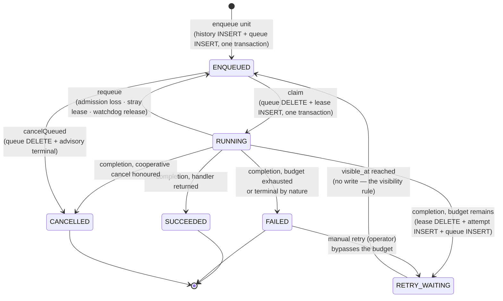

# Execution lifecycle

Status: Active · Last Reviewed: 2026-08-29 · Source of Truth: Repository

This is the single most important document for understanding Mohs at runtime. It describes the
states an execution passes through, *which storage fact defines each state*, and *which transaction*
performs each transition.

## The states

`io.mohs.core.execution.ExecutionState` has six values, in lifecycle order:



### What defines each state

The `state` column in `mohs_execution` is **advisory** — it reads `PENDING` from birth until a
terminal write. The truth, while work is in flight, lives in the queue and the ownership table:

| Derived state | Storage fact |
| --- | --- |
| `RUNNING` | A row exists in `mohs_lease` for this id. `owner` = its `node_id`, `firedAt` = its `claimed_at` |
| `RETRY_WAITING` | A row exists in `mohs_ready` with `attempt > 1` and `visible_at > now` |
| `ENQUEUED` | Any other row in `mohs_ready`; **also** a `PENDING` history row with neither queue nor lease (the bounded staleness of a completion flush in progress) |
| `SUCCEEDED` / `FAILED` / `CANCELLED` | The `state` column holds that value |

The consequence: **`RETRY_WAITING` is not a claimable state.** There is one admission rule in the
queue — `visible_at <= now` — and retry, delay, requeue and immediate enqueue are the same
operation with a different `visible_at`. The state name changed from `RETRY_SCHEDULED` to
`RETRY_WAITING` to carry exactly that meaning: "scheduled" promised a state the claim read, while
"waiting" says what it is.

## Transaction map

Every transition, and the exact transaction that performs it:

| Transition | Statements, in one transaction | Isolation | Class |
| --- | --- | --- | --- |
| **Enqueue** (manual, batch member) | `INSERT mohs_idempotency` (when a key is present) → `INSERT mohs_execution` → `INSERT mohs_ready` | Inherited; `PROPAGATION_NESTED` (a savepoint inside the host's transaction) | `JdbcStoreTransactions`, `ScheduleCommandImpl` |
| **Trigger firing** | `UPDATE mohs_job_definitions SET next_fire_at = :new WHERE next_fire_at = :observed AND retired = false` → on success, `INSERT mohs_execution` + `INSERT mohs_ready` for each occurrence | Explicit `READ COMMITTED` | `JdbcTriggerFirer` |
| **Claim** | `SELECT … FOR UPDATE SKIP LOCKED` (or `TOP … WITH (UPDLOCK, ROWLOCK, READPAST)`) → `DELETE mohs_ready` → `INSERT mohs_lease` | Explicit `READ COMMITTED`, `REQUIRES_NEW` | `JdbcWorkQueue#claim` via `JdbcDelegate#claimReady` |
| **Completion** | `DELETE mohs_lease WHERE (execution_id, node_id, epoch)` → `INSERT mohs_attempt` → `UPDATE mohs_execution` (terminal) *or* `INSERT mohs_ready` (retry) → batch counter → fixed-delay rearm | Explicit `READ COMMITTED`, `REQUIRES_NEW` | `JdbcLeaseStore#complete` |
| **Requeue** | `DELETE mohs_lease` fenced by `(node_id, epoch)` → `INSERT mohs_ready` with the *same* attempt | Explicit `READ COMMITTED`, `REQUIRES_NEW` | `JdbcWorkQueue#requeue` |
| **Cancel a queued execution** | `DELETE mohs_ready` → `UPDATE mohs_execution SET state='CANCELLED'` → batch counter | Explicit `READ COMMITTED`, `REQUIRES_NEW` | `JdbcWorkQueue#cancelQueued` |
| **Manual retry** | `UPDATE mohs_execution SET state='PENDING'` guarded by `state='FAILED' AND correlation_id IS NULL AND job not retired` → `INSERT mohs_ready` deriving attempt from `COUNT(mohs_attempt)+1` | Explicit `READ COMMITTED`, `REQUIRES_NEW` | `JdbcWorkQueue#rearmForManualRetry` |
| **Rate-limit charge** | Guarded `UPDATE mohs_rate_limits`, up to 3 CAS attempts | Requires `READ COMMITTED` (re-reads between attempts) | `JdbcRateLimitStore#charge` |

Two structural rules behind that table:

- **Claim and completion always open their own transaction** (`REQUIRES_NEW`) and set isolation
  explicitly. With the default `REQUIRED`, an outer transaction (a test, an interceptor) would
  impose *its* isolation and the required `READ COMMITTED` would be silently ignored — MySQL
  defaults to `REPEATABLE READ`, which is the divergence this killed.
- **The enqueue unit is the opposite**: `PROPAGATION_NESTED`, so it *joins* the host's transaction as
  a savepoint. This is what makes the idempotency check composable: a primary-key conflict undoes
  only the enqueue unit, leaving the connection healthy (on PostgreSQL a violation without a
  savepoint aborts the whole transaction) and the host's transaction still committable.

## The end-to-end happy path

```mermaid
sequenceDiagram
    participant App as Application
    participant Facade as MohsImpl / ScheduleCommandImpl
    participant Tx as StoreTransactions
    participant Hist as HistoryStore
    participant Q as WorkQueue (mohs_ready)
    participant Loop as Engine loop
    participant Lease as LeaseStore (mohs_lease)
    participant Disp as Dispatcher
    participant H as Handler
    participant Batcher as CompletionBatcher

    App->>Facade: mohs.schedule(ref, payload).now()
    Facade->>Tx: inTransaction(...)
    Tx->>Hist: record(NewExecution)  [+ idempotency key]
    Tx->>Q: offer(ReadyEntry, visible_at = now)
    Tx-->>Facade: commit
    Facade->>Loop: signalWorkScheduled() (after commit)
    Facade-->>App: Enqueued receipt (durable ExecutionId)

    Loop->>Loop: tick: heartbeat, signals, maintenance
    Loop->>Loop: fireDueTriggers()
    Loop->>Loop: Admission.compute (window, cap, rate limit)
    Loop->>Q: claim(shard, nodeId, epoch, limit, inadmissible, now)
    Q->>Lease: DELETE ready + INSERT lease (same tx)
    Q-->>Loop: List<ClaimedWork>
    Loop->>Loop: admit(): window, cap headroom, rate-limit charge
    Loop->>Hist: findPayloads(ids)   [ONE batched read]
    Loop->>Disp: runAsync on the job's runner
    Disp->>H: interceptor chain then handler.invoke(payload, ctx)
    H-->>Disp: return
    Disp->>Batcher: submit(CompletionResult, onOutcome)
    Batcher->>Lease: complete([...], jobStore)  [group commit]
    Lease-->>Batcher: Map<ExecutionId, Completion>
    Batcher->>Disp: onOutcome(completion) on the flusher thread
    Disp->>Disp: metrics + publish Succeeded (only if the fence held)
```

## The tick

One iteration of the engine loop, in exact order (`Engine#tick`):

| # | Step | Runs when | Isolated from failure? |
| --- | --- | --- | --- |
| 1 | `renewNodeLease` — self-diagnose expiry, bump epoch if needed, heartbeat | Always, in every state | **No** — deliberately outside the isolation: with no heartbeat the node is already dead to its peers, so continuing the tick would help nobody |
| 2 | `signalJobTimeouts` | Always | Yes |
| 3 | `pollCancelRequests` | Always | Yes |
| 4 | `signalWatchdogOverruns` | Always | Yes |
| — | *return early if not `RUNNING`* | | |
| 5 | `loadDefinitions` — one scan of the definitions table | `RUNNING` | No (the tick's own try/catch) |
| 6 | `nodeStore.findAll()` — one read serving both the reaper and the shard assignment | `RUNNING` | No |
| 7 | `reapOrphanedLeases` | `RUNNING` | Yes |
| 8 | `reconcileOwnStrayLeases` | `RUNNING` | Yes |
| 9 | `purgeStaleNodeRows` | `RUNNING` | Yes |
| 10 | `fireDueTriggers` | `RUNNING` | Per-job (one job's failure does not stop the sweep) |
| 11 | `claimAndDispatch` | `RUNNING` | No — it is the reason the tick exists |

Step-level isolation (`runMaintenance`) exists because *the granularity of error handling is the
granularity of degradation*. A single `try` around all seven steps meant that a persistently failing
purge — the same `DELETE` issued by every node on every tick, a classic deadlock candidate on SQL
Server — stole firing and claiming forever, leaving a node alive, heartbeating, owning 1/n of the
shards and claiming nothing.

### The sleep

After the tick, the loop sleeps. The interval is computed as:

```
delay      = workFound ? poll-interval : min(delay × 2, max-poll-interval)
delay      = cappedByNextFire(delay, earliest armed next_fire_at, now, floor = poll-interval)
actualWait = min(delay, node-lease-ttl / 3)
```

Three separate mechanisms, each with a distinct job:

1. **Adaptive backoff** — the idle cost control. Starts at the floor, doubles on every empty tick,
   returns to the floor on the first tick that finds work.
2. **The trigger cap** — the backoff is blind to deadlines, and a recurring job has a known one. It
   shortens the *sleep* without touching the backoff's state, with `poll-interval` as a floor so
   that N dense triggers cannot redefine the loop's cadence.
3. **The liveness cap** — the heartbeat rides on the tick, so the tick's cadence *is* the liveness
   promise's cadence. A backoff ceiling above `node-lease-ttl/3` must not let an idle node be
   declared dead. If `poll-interval` itself exceeds that cap, `start()` logs a WARN naming the
   effective cadence.

The sleep is interruptible: `Engine#wake()` is called by `stop`, by `resume`, and by
`signalWorkScheduled` (a same-JVM enqueue, after commit).

## Failure-mode catalogue

Every way an execution can leave `RUNNING` other than by finishing, and how it is resolved:

| Failure | Detection | Resolution | Guarantee |
| --- | --- | --- | --- |
| Handler throws, budget remains | The dispatcher's `catch` | Lease deleted, attempt recorded, queue entry reborn with backoff — **one transaction** | Retry, no duplicate |
| Handler throws, budget exhausted | `RetrySchedule.nextRetryAt` returns empty | Terminal `FAILED`; `Failed(attemptsExhausted = true)` published | Terminal |
| Node dies (kill, crash, OOM) | Its node lease expires; a peer's reaper sees the lease with an owner absent from the live set | Synthetic `FAILED` attempt + requeue through the budget, all fenced by the **dead** node's `(node_id, epoch)` | At-least-once when `retries > 0`; at-most-once when `retries = 0` |
| Node stalls longer than its lease, then resumes | The node itself, in `renewNodeLease`, sees `now >= nodeLeaseExpiresAt` | Bumps its own epoch and logs a WARN. Every in-flight completion it later attempts loses the fence and is discarded | No double completion |
| Work lost between claim and dispatch (payload read failed, executor rejected, terminal write threw) | `reconcileOwnStrayLeases`: a lease owned by this node with no in-flight incarnation | Requeued with the **same** attempt number — nothing ran, so the budget is untouched | No budget consumed |
| Handler exceeds `mohs.engine.watchdog-timeout` | `signalWatchdogOverruns`, using monotonic time from the submit | Ownership released through the retry budget; the local handler keeps running as a zombie and its result is fenced out | Retry |
| Payload unreadable (corrupt JSON, class gone from the classpath) | `HistoryStore#findPayloads` returns it in `unreadable` — a **per-row** verdict | Immediate terminal `FAILED` with `attemptsExhausted = false`. It does not heal by re-reading | Terminal, not retried |
| The payload *query* fails (infrastructure) | The whole `findPayloads` call throws | The batch keeps its lease; the tick ends its rounds; a reaper resolves it if this node dies. **Never** a terminal failure | Preserved |
| Definition removed between claim and dispatch | `storedJobFor` returns null after a fresh re-query | Terminal `FAILED` with a message naming the cause | Terminal |
| Runner name does not resolve | `RunnerRegistry#resolve` throws `NoSuchElementException` | Terminal `FAILED` naming the runner | Terminal |
| No handler registered for the job | `HandlerRegistry#find` empty at dispatch time | Goes **through the retry budget** on purpose: during a rolling update another node running the newer version may claim the retry | Retry |
| Shutdown grace expires with work in flight | `Engine#escalateAfterDrainGrace` | Flag + interrupt; attempts fail with a node-shutdown cause and follow the normal retry | Retry |
| Admission lost after the claim (cap turned, rate limit taken) | `Engine#admit` | Requeued with the same attempt and `visible_at = now`; counted in `mohs.claim.requeued` | No budget consumed |

## Two windows that are declared, not hidden

1. **The group-commit durability window.** With batching on (the default), the gap between "the
   handler finished" and "the result is durable" grows from about 1 ms to at most the flush interval
   (5 ms). A crash in that window re-executes up to `flushSize` results beyond those in flight. The
   contract was already at-least-once — this changes the *exposure to duplicates*, not the
   guarantee. `mohs.engine.completion-flush-on-every-result=true` restores the old behaviour.
2. **The cancel-flag window.** The cooperative cancel flag lives on the lease and dies with it. A
   cancel landing between the end of the handler and the flush's commit is lost, and an eventual
   retry runs. Acceptable for cooperative cancellation — the operator re-cancels the retry.
