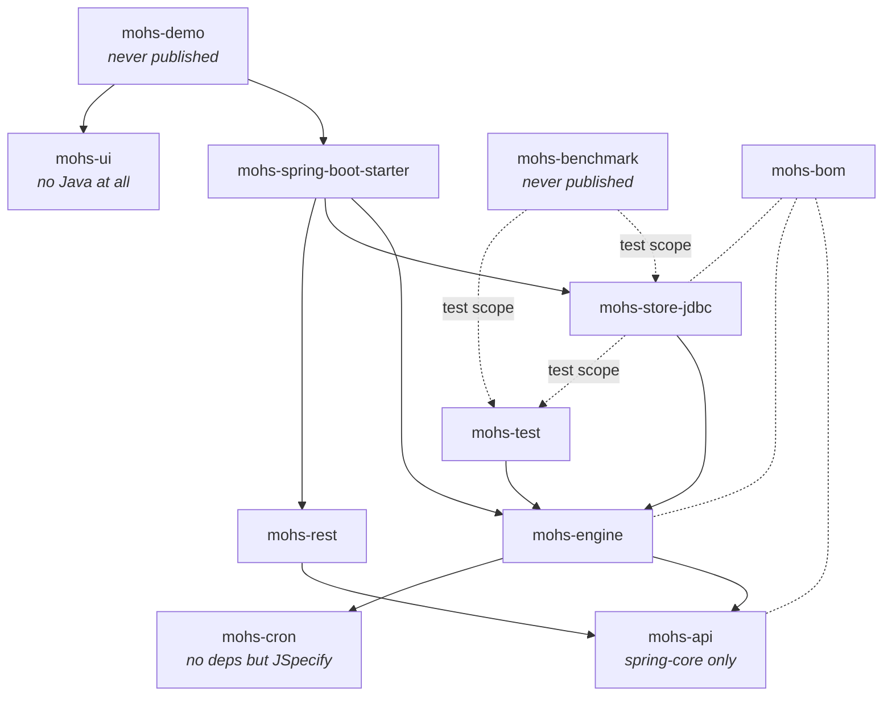

# Module architecture

Status: Active · Last Reviewed: 2026-08-29 · Source of Truth: Repository (`pom.xml` of each module)

Eleven Maven modules under `io.mohs:mohs-parent:0.0.1-SNAPSHOT`. The naming rule is mechanical: the
module name is the package with `.` replaced by `-`, with four deliberate exceptions listed at the
end.

## Dependency graph



## Module reference

### `mohs-cron`

| | |
| --- | --- |
| **Purpose** | Parsing and next-occurrence computation for seconds-first cron expressions with Quartz extensions (`L`, `W`, `#`). |
| **Public API** | `CronExpression.parse(String)`, `CronExpression#next(ZonedDateTime)` |
| **Dependencies** | None beyond JSpecify (inherited from the parent). |
| **Consumers** | `mohs-engine` (`NextFireCalculator`) |
| **Notes** | Vendored from `org.springframework.scheduling.support` under Apache 2.0. Self-contained by design: it does not know `CronSpec` or `JobDefinition` — stitching it to the domain vocabulary is the engine's job. `NOTICE` records one functional divergence from upstream, in `QuartzCronField#nextOrSame`: the roll-forward is retried in a loop against the seed so that `next()` cannot return its own argument for `L-n` day-of-month expressions. |
| **Tests** | `CronExpressionTest` |

### `mohs-api`

| | |
| --- | --- |
| **Purpose** | The entire public API. 100% contract: records, sealed types, plain interfaces. |
| **Public API** | `io.mohs.core` and six subpackages — see [package architecture](package-architecture.md). |
| **Dependencies** | `spring-core` only, for `@AliasFor` (used by the annotation stereotypes) and `@CheckReturnValue`. |
| **Consumers** | Everything. |
| **Notes** | Carries a `module-info.java` (`module io.mohs.core`) exporting all seven packages. Its value is the *other* side of JPMS: it establishes the pattern under which internal modules stop exporting what is `public` only because the language offered no alternative. |
| **Tests** | 17 test classes covering record invariants, validation and sealed-type exhaustiveness. |

### `mohs-engine`

| | |
| --- | --- |
| **Purpose** | The execution engine: poll loop, trigger firing, claim, admission, dispatch, retry, reaper, metrics — plus the persistence ports it runs over. |
| **Key types** | `Engine` (1,768 lines; implements `MohsLifecycle`), `Dispatcher`, `MohsImpl` (implements `Mohs`), `CompletionBatcher`, `RunnerRegistry`, `MohsExecutors`, `FiringPlanner`, `NextFireCalculator`, `RetrySchedule`, `Shards`, `CancellationSignal`, `EngineMetrics`, `EngineSettings` |
| **Ports (interfaces this module defines and does not implement)** | `JobStore`, `WorkQueue`, `LeaseStore`, `HistoryStore`, `NodeStore`, `BatchStore`, `RateLimitStore`, `TriggerFirer`, `StoreTransactions`, `SyncableClock`, `JobHandler` |
| **Dependencies** | `mohs-api`, `mohs-cron`, `uuidv7`, `slf4j-api`, `micrometer-core`, `spring-context`, `spring-tx` |
| **Consumers** | `mohs-store-jdbc`, `mohs-test`, `mohs-spring-boot-starter` |
| **Extension points** | None public. `HandlerRegistry#register` is the manual seam used by the scanner and by tests. |
| **Tests** | 13 in-module test classes (pure logic: shards, retry, firing plan, metrics, cancellation). The tests that need a real store live in `mohs-store-jdbc/src/test` under the same package. |

### `mohs-store-jdbc`

| | |
| --- | --- |
| **Purpose** | JDBC implementation of every engine port, plus schema ownership. |
| **Key types** | `JdbcJobStore`, `JdbcWorkQueue`, `JdbcLeaseStore`, `JdbcHistoryStore`, `JdbcNodeStore`, `JdbcBatchStore`, `JdbcRateLimitStore`, `JdbcTriggerFirer`, `JdbcStoreTransactions`, `DatabaseClock`, `MohsFlyway`, `JdbcTimestamps`, `JdbcSupport` |
| **Dialect subpackage** | `JdbcDialect` plus `H2JdbcDialect`, `PostgresJdbcDialect`, `MySqlJdbcDialect`, `SqlServerJdbcDialect`, and the `ClaimedReady` row record |
| **Dependencies** | `mohs-engine`, `spring-boot-starter-jdbc`, `spring-boot-starter-jackson`, `uuidv7`, `flyway-core` plus the postgresql/mysql/sqlserver Flyway modules, `slf4j-api` |
| **Resources** | Per-dialect migrations under `io/mohs/store/jdbc/migration/{h2,mysql,postgresql,sqlserver}/`, plus four `schema-*.sql` files that are the parallel hand-install path |
| **Tests** | 28 classes. Testcontainers for PostgreSQL, MySQL and SQL Server; H2 in-process. **Requires Docker**; without it the container-backed tests fail on `Could not initialize class *TestSupport`, which is an environment failure, not a regression. |
| **Notable guards** | `TerminalStateWriteScanTest` scans this module's own source; `Schema*RoundTripTest` compares the Flyway path against the hand-install path; `SqlServerUnicodeScanTest` guards `NVARCHAR` usage. |

### `mohs-rest`

| | |
| --- | --- |
| **Purpose** | The operational REST API v1. |
| **Layout** | One subpackage per controller, 1:1 with the resource areas: `overview`, `job`, `execution`, `batch`, `ratelimit`, `runner`, `node`; plus the package root (cross-cutting types) and `error` (RFC 7807 translation). |
| **Dependencies** | `mohs-api`; `spring-boot-starter-webmvc` marked `<optional>` (the actuator pattern), `spring-boot-starter-jackson`, `spring-boot`, `spring-tx`, `slf4j-api` |
| **Consumers** | `mohs-spring-boot-starter` (which registers the controllers as beans) |
| **Extension points** | `ActorResolver` — the one SPI in this module. Replaceable via `@ConditionalOnMissingBean`. |
| **Constraint** | May not depend on the engine or the store. This is why the `Mohs` facade exposes read methods (`jobs`, `nodes`, `runners`, `overview`, `executions`, `payloadType`) that exist solely for REST. |
| **Tests** | 15 classes, all `@WebMvcTest`-style contract tests over a mocked `Mohs`. |

### `mohs-ui`

| | |
| --- | --- |
| **Purpose** | The operational dashboard. |
| **Contents** | **No Java source at all.** A jar carrying only the built React/TypeScript bundle at `classpath:/mohs-ui-webapp`. |
| **Build** | `frontend-maven-plugin` installs Node v22.12.0, runs `npm ci` and `npm run build`; `maven-resources-plugin` copies `frontend/dist` into `target/classes/mohs-ui-webapp`. |
| **Escape hatch** | `-Dskip.frontend=true` skips Node entirely. **A published jar must never be built with it** — `mohs-ui` would ship empty. |
| **Served by** | `MohsUiAutoConfiguration` in the starter, gated by `@ConditionalOnResource` on `index.html` rather than by a marker class — which is why the starter does not depend on this module. |
| **Notes** | Prose in this subtree is English, deliberately diverging from the Portuguese Javadoc convention used elsewhere. |

### `mohs-test`

| | |
| --- | --- |
| **Purpose** | Test kit for consumers exercising their own handlers. |
| **Public API** | `MutableClock` (a deterministic `Clock` with `setTo`/`advance`), `InMemoryJobStore` (a `JobStore` with no database) |
| **Dependencies** | `mohs-engine` |
| **Notes** | `InMemoryJobStore` is also the proof that `JobStore` leaked nothing JDBC-specific. It declares two deliberate divergences from the JDBC adapter: it does not heal a disarmed trigger (unreachable state without a `TriggerFirer`), and `remove` is a hard delete rather than a soft retire. |
| **Constraint** | `test_kit_does_not_leak_into_production` — nothing outside `io.mohs.test` may depend on it. |

### `mohs-spring-boot-starter`

| | |
| --- | --- |
| **Purpose** | The composition root. Turns beans and properties into a running engine. |
| **Key types** | `MohsAutoConfiguration`, `MohsRestAutoConfiguration`, `MohsUiAutoConfiguration`, `MohsProperties`, `MohsJobScanner`, `MohsJobs`, `MohsRunners`, `MohsRateLimits`, `MohsEngineLifecycle`, `MohsOverviewStreamLifecycle` |
| **Registration** | `META-INF/spring/org.springframework.boot.autoconfigure.AutoConfiguration.imports` lists the three auto-configurations. |
| **Dependencies** | `mohs-engine`, `mohs-store-jdbc`, `mohs-rest`, `spring-boot-starter`, `spring-boot-autoconfigure`, `spring-boot-starter-jdbc`, `spring-boot-starter-jackson`, and `spring-boot-starter-webmvc` as `<optional>` |
| **Privilege** | The only package permitted to depend on `io.mohs.engine` and `io.mohs.store.jdbc`, and the only one permitted to speak `org.springframework.boot.autoconfigure`. |
| **Notes** | Declares `spring-boot-configuration-processor`, so `mohs.*` properties get IDE metadata from the `@param` tags on `MohsProperties`. |

### `mohs-demo`

| | |
| --- | --- |
| **Purpose** | A development application. **Never published.** |
| **Contents** | `MohsApplication` (Spring Boot bootstrap) and `Demo` (three sample jobs and one `RateLimit` bean). |
| **Special role** | The only module that sees every other module on one classpath — which is why `ArchitectureTest` lives here. |
| **Notes** | Deliberately has **no `src/main/resources/application.yaml`**: an `application.yaml` at a library jar's classpath root competes with the host's own. Local defaults are set via `SpringApplication#setDefaultProperties`, which loses to any external source. Its `@ComponentScan` excludes `io.mohs.rest` so the ordinary scan does not collide with the explicit controller beans. |

### `mohs-benchmark`

| | |
| --- | --- |
| **Purpose** | Load and chaos harnesses. **Never published.** |
| **Contents** | `ScenarioCluster` (N engines in one JVM against a real PostgreSQL container) plus nine scenarios: `BatchCompletion`, `ColdStart`, `ConcurrentMigration`, `NodeChurn`, `OverviewLatency`, `RateLimitCeiling`, `RecurringTrigger`, `RollingUpdate`, `ShutdownLatency`. |
| **Scripts** | `scripts/write-amplification.ps1`, `scripts/chaos-recovery.ps1`, `scripts/cluster-scale.ps1` |
| **Execution** | Scenarios are **not** picked up by Surefire's default pattern in the reactor build; run them by name: `./mvnw -pl mohs-benchmark test -Dtest=NodeChurnScenario`. |
| **Notes** | No JMH. `ScenarioCluster` deliberately mirrors `MohsAutoConfiguration`'s wiring — a verdict about lost work drawn from a wiring nobody runs in production would not be admissible as release evidence. |

### `mohs-bom`

| | |
| --- | --- |
| **Purpose** | A bill of materials pinning every published `io.mohs` artifact at one version. |
| **Contents** | `dependencyManagement` only, listing `mohs-cron`, `mohs-api`, `mohs-engine`, `mohs-store-jdbc`, `mohs-rest`, `mohs-ui`, `mohs-test`, `mohs-spring-boot-starter`. |
| **Notes** | `mohs-demo` and `mohs-benchmark` are absent by design: they are not published. |

## Naming exceptions

The "module name = package with dots replaced by hyphens" rule has four exceptions:

| Package | Module | Reason |
| --- | --- | --- |
| `io.mohs.core` | `mohs-api` | The artifact was renamed to say what it is; the *package* is a frozen public contract. |
| `io.mohs.autoconfigure` | `mohs-spring-boot-starter` | Spring Boot naming convention for starters. |
| `io.mohs` + `io.mohs.demo` | `mohs-demo` | Bootstrap and samples share one module. |
| *(none)* | `mohs-ui` | Resource-only jar; there is no Java package. |

## What a consumer declares

```xml
<dependencyManagement>
  <dependencies>
    <dependency>
      <groupId>io.mohs</groupId>
      <artifactId>mohs-bom</artifactId>
      <version>${mohs.version}</version>
      <type>pom</type>
      <scope>import</scope>
    </dependency>
  </dependencies>
</dependencyManagement>

<dependencies>
  <!-- engine + store + REST contract + autoconfiguration -->
  <dependency>
    <groupId>io.mohs</groupId>
    <artifactId>mohs-spring-boot-starter</artifactId>
  </dependency>

  <!-- optional: the dashboard bundle -->
  <dependency>
    <groupId>io.mohs</groupId>
    <artifactId>mohs-ui</artifactId>
  </dependency>

  <!-- optional: MutableClock / InMemoryJobStore for your own tests -->
  <dependency>
    <groupId>io.mohs</groupId>
    <artifactId>mohs-test</artifactId>
    <scope>test</scope>
  </dependency>
</dependencies>
```

The REST layer's web dependency is `<optional>` in `mohs-rest` and in the starter, following the
actuator pattern: an application without `spring-boot-starter-webmvc` gets the engine and no
controllers, and `MohsRestAutoConfiguration` never loads (`@ConditionalOnClass(DispatcherServlet)`).
