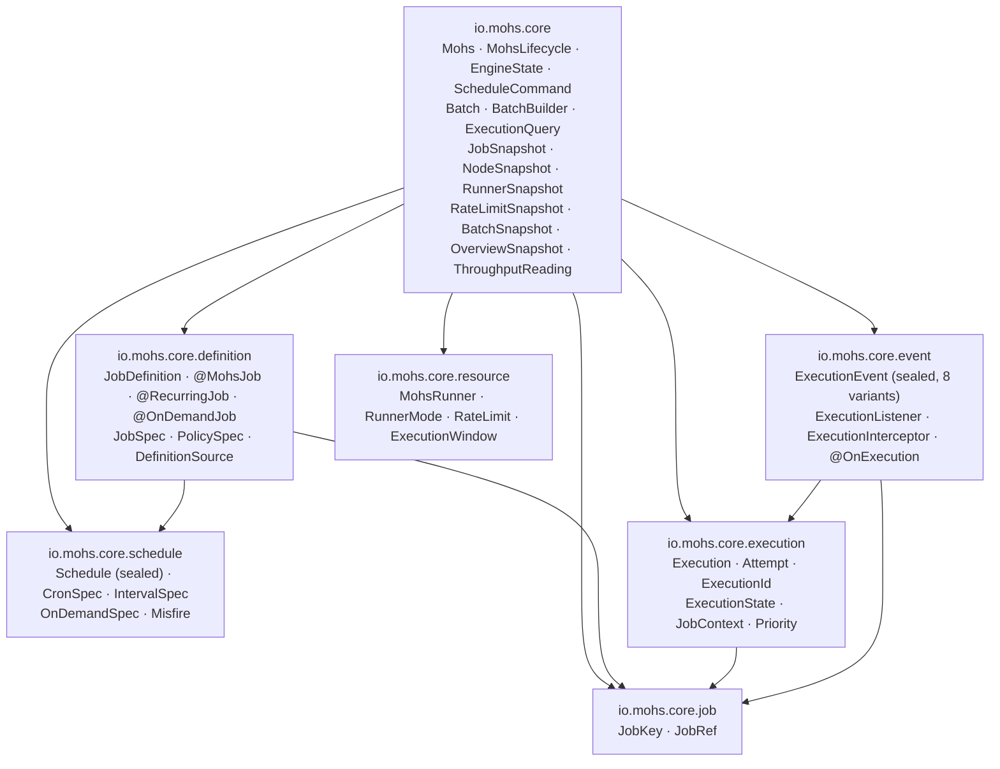
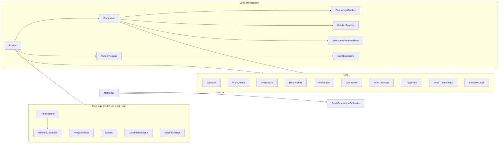

# Package architecture

Status: Active · Last Reviewed: 2026-09-05 · Source of Truth: Repository (`package-info.java` of each package)

Every production package carries a `package-info.java` with `@NullMarked` and a prose contract.
Nothing in the build verifies it since the ArchUnit suite went away; review is the guard.

## The public API: `io.mohs.core` and its six subpackages

Keep the subpackage graph acyclic; this is a review convention, not a whole-reactor test. The cut is by cohesion, and the reason
`job` exists as a package of its own is precisely to keep the graph acyclic.

`io.mohs.core.resource` depends on no other public subpackage.

### Package contracts

| Package | Holds | Depends on |
| --- | --- | --- |
| `io.mohs.core` | The facade and the types appearing only in its own signatures: `Mohs`, `MohsLifecycle`, `EngineState`, `ScheduleCommand`, `Batch`, `BatchBuilder`, `ExecutionQuery`, and the read models (`*Snapshot`, `ThroughputReading`) | All six subpackages |
| `io.mohs.core.job` | Identity: `JobKey`, `JobRef<T>` | nothing |
| `io.mohs.core.schedule` | The trigger only: sealed `Schedule` with `CronSpec`/`IntervalSpec`/`OnDemandSpec`, plus `Misfire`. Pure data, no builder. | nothing |
| `io.mohs.core.definition` | `JobDefinition`, the annotations, the staged builder `JobSpec` → `PolicySpec`, `DefinitionSource` | `job`, `schedule` |
| `io.mohs.core.execution` | `Execution`, `Attempt`, `ExecutionId`, `ExecutionState`, `JobContext`, `Priority` | `job` |
| `io.mohs.core.event` | Sealed `ExecutionEvent` (8 variants), `ExecutionListener`, `ExecutionInterceptor`, `@OnExecution`, `ExecutionEventType` | `job`, `execution` |
| `io.mohs.core.resource` | `MohsRunner`, `RunnerMode`, `RateLimit`, `ExecutionWindow` — specifications, never live objects | nothing |

### The compatibility contract, stated in `io.mohs.core/package-info.java`

This is the single most important thing to know before extending Mohs:

| Interface | Extendable by consumers? |
| --- | --- |
| `Mohs`, `MohsLifecycle`, `ScheduleCommand`, `Batch`, `BatchBuilder`, `JobContext` | **No.** They are non-sealed only because the implementation lives in another module and the project does not use a JPMS `permits` clause across them. They **may gain methods in minor releases**. Implementing them yourself breaks with `AbstractMethodError` on the first new method. To test handlers, use `io.mohs.test`. |
| `ExecutionListener`, `ExecutionInterceptor`, `RetryPolicy` | **Yes.** All are `@FunctionalInterface`, stable by contract. These are the supported extension points. |
| `io.mohs.rest.ActorResolver` | **Yes.** The SPI of the REST module. |
| `JobSpec`, `PolicySpec`, `Schedule`, `ExecutionEvent` and the other sealed types | Not implementable by consumers; added variants may require updating exhaustive switches. |

## Internal packages

### `io.mohs.engine`

Holds the loop, the dispatch pipeline, the pure-logic helpers, and the **ports** that
`io.mohs.store.jdbc` implements.

Port grouping is by **concept**, matching the table split:

| Concept | Port | Table(s) |
| --- | --- | --- |
| Definitions (control plane) | `JobStore` | `mohs_job_definitions` |
| Queue | `WorkQueue` | `mohs_ready` (+ `mohs_lease` on claim) |
| Ownership | `LeaseStore` | `mohs_lease` (+ history on completion) |
| History | `HistoryStore` | `mohs_execution`, `mohs_attempt`, `mohs_idempotency` |
| Trigger firing | `TriggerFirer` | `mohs_job_definitions` + history + queue, one transaction |
| Batches | `BatchStore` | `mohs_batches` |
| Rate limits | `RateLimitStore` | `mohs_rate_limits` |
| Node registry | `NodeStore` | `mohs_nodes` |
| Enqueue unit boundary | `StoreTransactions` | — |
| Time source | `SyncableClock` | — |

Two notes on the port design:

- **`LeaseStore#complete` writes history**, and that is deliberate. The ports follow concepts, and a
  completion is a concept *of ownership* that happens to touch history — not the other way round.
  Putting the terminal write in `HistoryStore` would split one transaction across two ports.
- **`HistoryStore#record` and `WorkQueue#offer` do not open transactions.** The caller must compose
  them into one, through `StoreTransactions`. Calling either alone is not a supported mode.

### `io.mohs.store.jdbc`

One `Jdbc*` Data Mapper per port, plus infrastructure:

| Class | Role |
| --- | --- |
| `JdbcJobStore` … `JdbcRateLimitStore` | Port implementations |
| `JdbcStoreTransactions` | The enqueue unit, `PROPAGATION_NESTED` (a savepoint inside the host's transaction) |
| `DatabaseClock` | `Clock` + `SyncableClock`; the one place reading the real clock is the purpose |
| `JdbcTimestamps` | The `Instant` ↔ column crossing, via `LocalDateTime`/`OffsetDateTime` (JDBC 4.2), never `java.sql.Timestamp` |
| `JdbcSupport` | Shared SQL constants and helpers (`READY_INSERT`, `FENCED_LEASE_DELETE`, chunking, stream fetch size) |
| `delegate/` | `JdbcDelegate` and the four implementations, each carrying the complete SQL for its database |

### `io.mohs.rest`

The package root carries only what more than one resource area uses, so it belongs to none:
`ActorResolver`, `HeaderActorResolver`, `CursorPage`, `AcceptedExecutionResponse`,
`RuntimePatchResponse`, `ApiPaths`, `ExecutionLocations`. `error/` holds the domain exceptions and
the `@RestControllerAdvice`. Every other subpackage is exactly one controller plus its DTOs.

**DTO suffix convention**, stated in the package contract:

- `*Response` is the default — for a direct body *and* for a nested DTO. Nesting is not the
  criterion.
- `*View` is reserved for two cases only: the wire adaptation of a sealed domain type mirroring its
  variants 1:1 (`ScheduleView`), or a computed projection with no counterpart type in `io.mohs.core`
  (`ThroughputView`).

### `io.mohs.autoconfigure`

The composition root. Four auto-configurations, one properties record, one scanner, three pure
assembler classes (`MohsJobs`, `MohsRunners`, `MohsRateLimits`) and two `SmartLifecycle` adapters.

Most internal infrastructure beans do not back off: applications configure them through
public resource beans and properties. `JdbcDelegate` explicitly supports a replacement bean;
REST permits a custom `ActorResolver`, and health permits replacing the named indicator.
`CompletionBatcher` is enabled by a property. These conditions are separate from the
`defaultCandidate = false` isolation of generic framework beans.

Every bean of a *generic framework type* (`Clock`, `ThreadPoolTaskScheduler`, `AsyncTaskExecutor`)
is declared `defaultCandidate = false` and injected by `@Qualifier`. Without that, merely putting
Mohs on the classpath would suppress the host's own auto-configured `taskScheduler` and
`applicationTaskExecutor` — silent degradation of the host application.

### `io.mohs.cron`

Self-contained. It knows nothing about `CronSpec` or `JobDefinition`. Files carry the original
Apache 2.0 headers plus a note describing the adaptation.

### `io.mohs.test`

Two classes, both manual seams: `MutableClock` and `InMemoryJobStore`.

### `io.mohs` (root) and `io.mohs.demo`

Only `mohs-demo`'s Spring Boot bootstrap and its sample jobs. Not library API.
