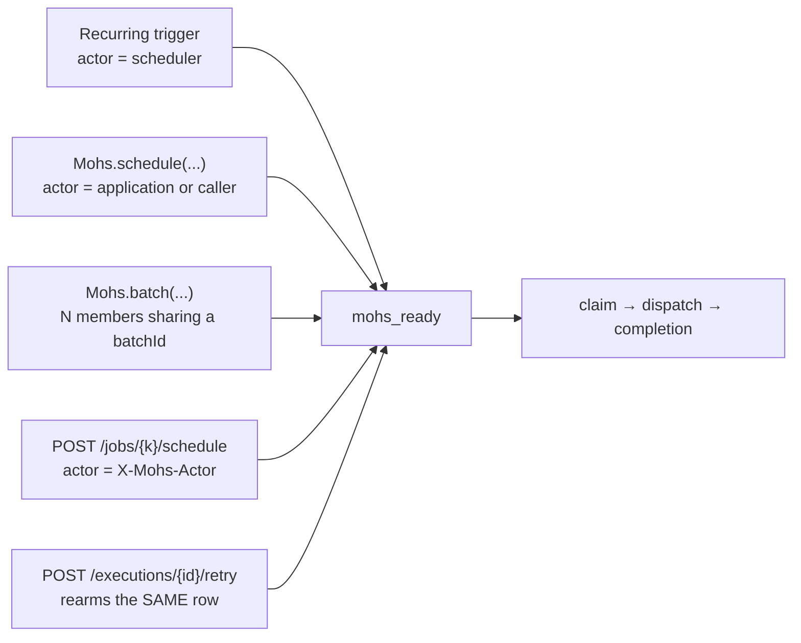

# 3. Functional documentation

Status: Active · Last Reviewed: 2026-08-29 · Source of Truth: Repository

Every meaningful behaviour Mohs implements, one document per feature area. Each answers: what it is,
who triggers it, what it writes, what it guarantees, how it fails, and what it deliberately does not
do.

| Document | Feature area |
| --- | --- |
| [job-definition-and-registration.md](job-definition-and-registration.md) | `@MohsJob` and its stereotypes, the programmatic builder, handler signatures, the boot-time scan, drift reconciliation, orphaning and retirement |
| [scheduling-and-triggers.md](scheduling-and-triggers.md) | Cron / fixed rate / fixed delay / on demand, DST handling, trigger firing and its CAS, misfire policies, pause and reschedule |
| [claim-and-dispatch.md](claim-and-dispatch.md) | The claim SQL per dialect, admission guards, the claim lap and idle gate, runners, group-commit completion |
| [retry-and-failure.md](retry-and-failure.md) | The retry budget, backoff with full jitter, outcome mapping, terminal-by-nature failures, the reaper's decision, manual retry |
| [cancellation-and-timeouts.md](cancellation-and-timeouts.md) | The three cancellation sources, the interrupt window, per-attempt timeouts, the watchdog bound, the escalation ladder |
| [batches.md](batches.md) | All-or-nothing creation, atomic counting, who fires `BatchCompleted`, `onCompletion`'s limits |
| [rate-limits-and-windows.md](rate-limits-and-windows.md) | The cluster-wide token bucket and its two-phase consumption; exclusion windows |
| [idempotency.md](idempotency.md) | `Idempotency-Key` deduplication, the savepoint that makes it composable, and what is deliberately not deduplicated |

## The five invocation paths

Everything in this section ultimately serves one of these:

None of them redefines job policy. Only `priority`, `actor` and `idempotencyKey` are per-invocation.
