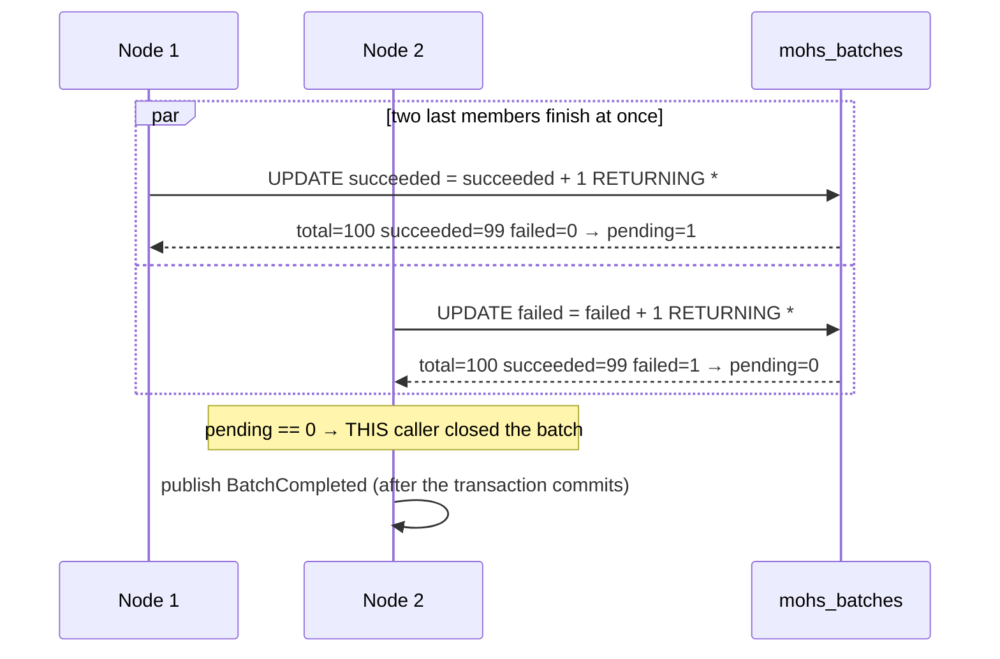

# Batches

Status: Active · Last Reviewed: 2026-09-05 · Source of Truth: Repository

A batch is a **flat set of independent members with a shared counter**. It is not a workflow: there
are no dependencies between members, no ordering, no compensation.

## Creating one

```java
Batch batch = mohs.batch("nightly-invoices", b -> {
    for (Customer c : customers) {
        b.add(SEND_INVOICE, new SendInvoice(c.id()));
    }
});

String id = batch.batchId();          // durable after the surrounding transaction commits

batch.onCompletion(done ->
        log.info("batch {} finished: {} ok, {} failed", done.name(), done.succeeded(), done.failed()));
```

## Guarantees at creation

| Guarantee | How |
| --- | --- |
| **All-or-nothing** | Every member is validated **before any write**, and the batch row plus all members enter in a single transaction. An exception from `batch(...)` guarantees nothing was persisted; the call can be repeated with no risk of a partial batch |
| The total is fixed at creation | Members are collected before the row exists, so there is no "still accepting members" state to track — the batch is born knowing how many completions will close it |
| An empty batch is refused | It would never complete, and a forever-open batch is worse than an error |
| Every member carries the `batchId` from birth | That is what makes its completion count towards the batch |
| All members share one `scheduledAt` | The batch was requested in one go |
| The name is validated at the door | Non-null, non-blank, at most 255 characters (the column's ceiling in all four dialects) |

Validation of *all* members before any write is not defensiveness. A nonexistent job discovered
halfway through would leave the batch row written with a full `total` and only part of the members
queued — the rest would never exist, the batch would never close, and `BatchCompleted` would never
fire, silently. That is exactly the failure mode the design exists to avoid.

Validation asks about **distinct keys**, not one query per member: a large batch usually points at
few jobs, and validating 1,000 members of a single job is one question, not a thousand.

The name is validated in the facade and not only in the record constructors, because of a real
defect: a blank name crossed the write, became durable, and only blew up on **read** — inside
`BatchCompleted`'s constructor, in the event channel where exceptions are swallowed by design, so
the user's `onCompletion` never ran. *A value the API accepts must not be a value it cannot read
back.*

## Counting

`mohs_batches` holds `total`, `succeeded`, `failed`. `pending` is **derived, never stored** — a
fourth column could drift from the other three, and there is no question it would answer faster.

| Rule | Where |
| --- | --- |
| A member counts only when it reaches a **terminal** state | `JdbcLeaseStore#countIntoBatch`: `terminalState == null` → no count |
| A retry does **not** count | Same guard — counting a retry would close the batch early |
| A `CANCELLED` member counts as a **failure** | The batch answers "how many succeeded" |
| A member cancelled while still queued also counts | `JdbcWorkQueue#cancelQueued` increments in the same transaction as the delete |
| The increment is atomic SQL, never read-then-write | Members of one batch complete concurrently on different threads |
| The increment happens **inside the completion transaction** | A separate write between the commit and a crash would be lost |

## Who fires `BatchCompleted`

The closer is **elected by the database**, inside the completion transaction:

`incrementSucceeded` / `incrementFailed` return the **post-increment** balance. Exactly one caller
sees `pending() == 0`, and that caller fires `BatchCompleted`. Asking afterwards through a separate
`find` would not do — two concurrent completions would read the same final balance and both would
believe they closed it.



The event is published **after** the transaction commits, alongside the completion's other events —
an event does not roll back if the transaction aborts.

## `onCompletion` — what it is, and what it is not

`Batch#onCompletion` registers an `ExecutionListener` like any other, **not a parallel delivery
path**: the `BatchCompleted` that fires the callbacks is exactly the event the dispatcher publishes.
Delivery therefore inherits the listener contract — asynchronous, best-effort, no ordering
guarantee.

**Genuinely best-effort, and specifically JVM-local.** The registration lives only in the JVM that
created the batch. A batch closed by *another node* publishes the event there, not here, and the
callback does not run.

| Property | Value |
| --- | --- |
| Multiple registrations | Each call registers an independent listener; `batch.onCompletion(a).onCompletion(b)` registers both |
| Returned `Batch` | The same batch, never a copy |
| Removal | A callback leaves the map when its batch closes **on this node** |
| Memory bound | An LRU with `MAX_TRACKED_BATCHES = 10_000`. In an N-node cluster roughly `(N−1)/N` of registrations would otherwise stay resident forever in a singleton bean |
| A throwing callback | Logged and swallowed; the remaining callbacks still run |

**For a guaranteed reaction, do not use this callback.** Enqueue the continuation inside the
handler's own transaction — the transactional outbox pattern. That is precisely why this registry
can be an in-memory map rather than persisted state.

## Reading a batch

`Mohs.findBatch(batchId)` returns a `BatchSnapshot`:

```java
public record BatchSnapshot(String batchId, String name, int total, int succeeded, int failed) {
    public int pending()      { return total - succeeded - failed; }
    public boolean completed(){ return pending() == 0; }
}
```

A seek on the primary key, **flat in the batch's size** — the maintained counter is what pays for
that. A batch does not reopen.

## The name is durable data

`name` is the label the caller gave in `Mohs.batch`. It appears in `BatchSnapshot`, in the
`BatchCompleted` event handed to `onCompletion`, and in `GET /batches/{id}`.

It used to be required and then discarded — whoever opened the dashboard at 3 a.m. found a UUID
where they had written `"nightly-invoices"`. It is now persisted and derived from nothing: it is the
only way for an operator to tie a batch back to the intent. It is also what makes a callback
registered on more than one batch usable without matching UUIDs by hand.

## Batch members and retry

**A batch member cannot be retried individually.** `Mohs.retry` refuses with an
`IllegalStateException` (HTTP 409), and `WorkQueue#rearmForManualRetry` enforces it in SQL with
`correlation_id IS NULL` in the CAS predicate.

The reason, in full: the batch already counted this failure, and the counter cannot give it back
without reopening the batch — which would stop `BatchCompleted` being terminal and, worse, the
second event would no longer find `onCompletion`'s one-shot callback. Whoever rescued the member is
precisely the person who would be left without the notification of the real end.

**To redo the work, schedule the job standalone.**

## REST surface

`GET /batches/{id}` returns `BatchResponse` with a derived `pending` and a derived
`state` (`RUNNING` / `COMPLETED`), so a caller can poll before completion.

## Limits

| Limit | Value |
| --- | --- |
| Members per batch | No hard cap in code. Bounded in practice by the single transaction that writes them all |
| Nested or dependent batches | **Not supported** |
| Partial cancellation of a batch | **Not supported** — cancel members individually; each cancel counts as a failure |
| Cross-node `onCompletion` delivery | **Not supported** — use a listener bean plus the `BatchCompleted` event, or the transactional-outbox pattern |
| Batch-level retry | **Not supported** |
