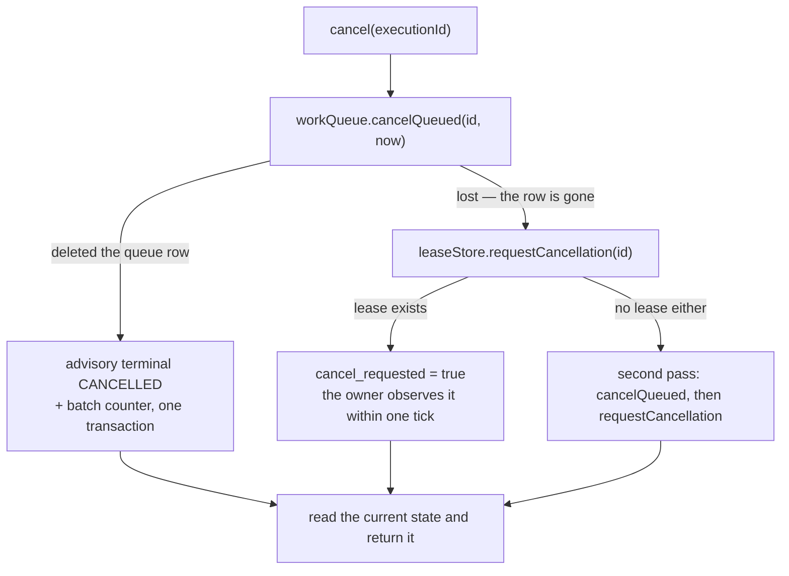
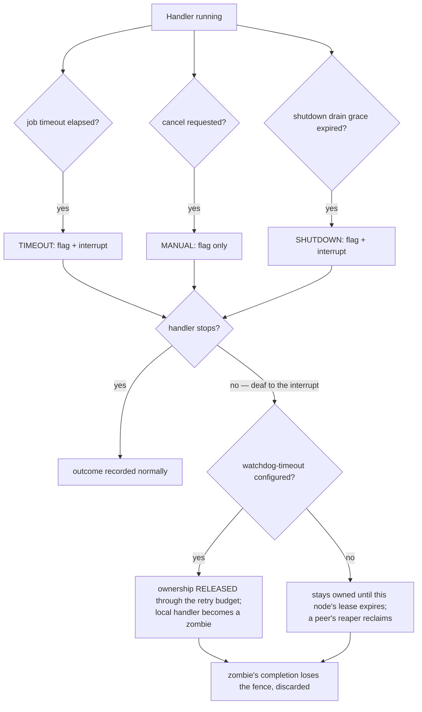

# Cancellation and timeouts

Status: Active · Last Reviewed: 2026-09-05 · Source of Truth: Repository

Cancellation in Mohs is **cooperative**. Nothing kills a thread; the handler decides when to stop.

## The three sources

They meet in one place, `CancellationSignal`, which belongs to a single dispatch incarnation:

| Reason | Raised by | Delivers an interrupt? |
| --- | --- | --- |
| `TIMEOUT` | `Engine#signalJobTimeouts` — the job's own `timeout` elapsed | **Yes** |
| `SHUTDOWN` | `Engine#escalateAfterDrainGrace` — the drain grace expired | **Yes** |
| `MANUAL` | `Engine#pollCancelRequests` — a `POST /executions/{id}/cancel` was observed | **No — a pure flag** |

The handler reads all three through the same method:

```java
@OnDemandJob("import-file")
void importFile(ImportRequest req, JobContext ctx) {
    for (Row row : rows) {
        if (ctx.cancellationRequested()) {
            throw new CancelledByOperator();   // or return — see below
        }
        process(row);
    }
}
```

## The outcome depends on the reason

| Reason | Handler throws | Handler returns normally |
| --- | --- | --- |
| `MANUAL` | Terminal `CANCELLED`. A cancel beats the retry budget | `SUCCEEDED` — finished work counts, even with a request pending |
| `TIMEOUT` | `FAILED`, wrapped in a `TimeoutException` naming the job's timeout; follows the retry budget | `SUCCEEDED` |
| `SHUTDOWN` | `FAILED`, cause "node shutdown: drain grace elapsed"; follows the retry budget | `SUCCEEDED` |

The asymmetry is deliberate: a raised signal reclassifies only an **abnormal** exit. Recording
anything but success for a handler that completed would lie, and would schedule a duplicate.

A **pre-start** check also exists: a signal raised while the task was still queued in the runner is
honoured *before* invoking the handler. `MANUAL` becomes `CANCELLED` without running; `SHUTDOWN`
becomes a node-shutdown failure without running — work not done, so a clean retry on another node.
Not starting new work is the first step of a graceful shutdown.

## Cancelling: the two halves

An execution can be cancelled in two places, and `Mohs.cancel` orchestrates both:



**Why a second pass.** The two predicates partition the state space, but the state can migrate
*between* the checks — an attempt completing takes `RUNNING` to `RETRY_WAITING` in the middle of the
pair, and the operator's order would fall into the gap. The second pass closes that window; another
migration would require a whole attempt cycle within microseconds.

On a terminal state both calls are no-ops: cancelling what has already decided changes nothing, and
the return shows the state that stood.

`cancelQueued` also counts the cancellation into its batch, in the same transaction as the delete —
cancelling is terminal, and an end that does not count leaves the batch open forever.

## Observing a `MANUAL` cancel

`Engine#pollCancelRequests`, once per tick:

1. Collect the in-flight ids whose signal is **not yet raised**.
2. If none, return without touching the database.
3. `leaseStore.findCancelRequested(ids)` — one batched read over the ownership table.
4. Raise `MANUAL` on each match, **without** an interrupt.

Staleness is at most one loop interval — between `mohs.engine.poll-interval` and
`min(max-poll-interval, node-lease-ttl/3)` depending on the backoff — plus the tick's own duration.
The poll runs in `PAUSED` and `DRAINING` too.

**A declared window**: the cooperative flag lives on the lease and dies with it. A cancel landing
between the end of the handler and the flush's commit (at most the flush interval) is lost, and an
eventual retry will run. Acceptable for cooperative cancellation — the operator re-cancels the
retry.

## Timeouts

`@MohsJob(timeout = "PT5M")` sets a per-attempt deadline, checked as a passenger on the tick's
sweep — zero new threads.

| Property | Value |
| --- | --- |
| Clock | The handler's **real start**, stamped monotonically in `CancellationSignal#registerHandlerThread`. Time queued in a runner does **not** count |
| Detection latency | Up to one loop interval |
| Effect | Raise `TIMEOUT` **and** interrupt the handler's thread |
| Outcome | Passive — recorded when the handler actually stops, never by the tick |
| Active in | `RUNNING`, `PAUSED` and `DRAINING` |

A handler that ignores the interrupt remains owned while the node is alive. A timeout alone
does not invalidate its fence, and a later normal return still records success. If a watchdog
releases ownership, or a peer reclaims it after node failure, the old handler becomes a zombie
and its later completion loses the fence.

## The interrupt window

The most delicate piece of concurrency in the codebase, and the reason it is a class of its own.
`CancellationSignal` shares one `ReentrantLock` between registration, interrupt delivery and
deregistration — the `FutureTask.cancel` problem:

```java
signal.registerHandlerThread();          // opens the window, starts the timeout clock
try {
    runInterceptorChain(handler, payload, ctx);
} finally {
    signal.unregisterHandlerThreadAndClearInterrupt();   // closes it, clears the flag
}
// ... only now does the completion write happen
```

Guarantees:

- An interrupt is delivered **only while the thread is registered**. Before registration or after
  deregistration, `requestCancellation` is a pure flag.
- Deregistration commits under the lock, *then* `Thread.interrupted()` clears any pending status.
  With deregistration committed, no concurrent `requestCancellation` can interrupt any more.
- Therefore **the completion write (JDBC) never runs interrupted**, and a CPU runner's platform
  thread never returns poisoned to its pool.

**The first reason wins, but interrupt delivery does not.** The reason decides the outcome mapping,
so it is first-wins. Delivery is not: a handler that caught the timeout's interrupt, cleaned up and
blocked again — a common pattern — was immune to the shutdown's interrupt, while the log promised
"signalling cancellation and interrupting them". Shutdown's lever cannot depend on who signalled
first.

There is no interrupt loop: `signalJobTimeouts` guards with `!cancellationRequested()`, and the
drain escalation runs at most twice per `stop`.

## The watchdog bound

`mohs.engine.watchdog-timeout` (**default: off**) is the next rung of the ladder — for a handler
that ignores everything.

| Property | Value |
| --- | --- |
| Measures | Submit-to-now in **monotonic** time. Waiting in a CPU runner's queue counts as runtime — deliberate semantics |
| Validation | Must be **greater than** `node-lease-ttl`. A smaller bound would release ownership before the node could even be considered dead |
| Effect | The node **releases ownership**: a synthetic `FAILED` attempt through the retry budget, fenced by this incarnation |
| The local handler | Keeps running as a zombie until it finishes on its own; its completion carries the same ownership, but the lease is already gone (and a re-claim writes a new owner and epoch), so its fence loses by construction |
| Marking | The in-flight entry is **marked**, not removed — the zombie stays reachable by the drain escalation and by the cancel poll |
| A failed release | Does not mark; the next tick tries again |

A boot-time WARN fires for any job whose declared `timeout` is greater than or equal to the watchdog
bound: the watchdog would release ownership before the job's own deadline, failing a still-healthy
run.

## The escalation ladder, end to end



## Limits, stated plainly

| Limit | Consequence |
| --- | --- |
| Cancellation is never immediate | The owner observes it within at most one loop interval |
| Cancellation is never guaranteed | A completion may win the race, and in that case it stands |
| A handler that never checks the flag and never blocks is uncancellable | Only the watchdog bound (if configured) or node death resolves it |
