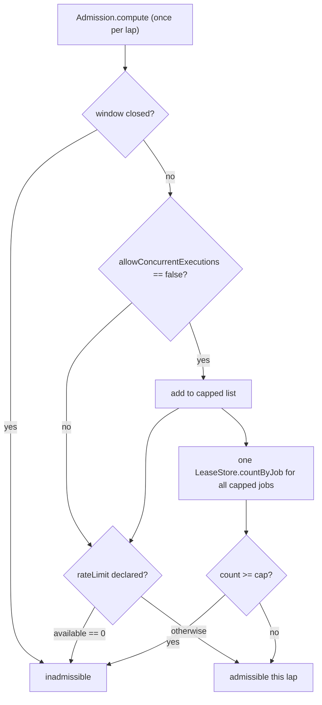
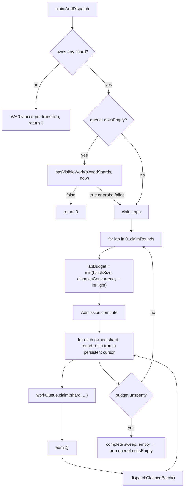

# Claim and dispatch

Status: Active · Last Reviewed: 2026-08-29 · Source of Truth: Repository

The hot path. Everything else in Mohs exists so that this stays cheap and correct.

## The claim

One statement per shard, inside one transaction that removes from the queue and inserts ownership.

### The portable form (H2, MySQL, SQL Server)

```sql
-- 1. candidate selection, holding row locks and skipping locked rows
SELECT execution_id, job_key, attempt, priority
  FROM mohs_ready
 WHERE shard = :shard AND visible_at <= :now
   AND job_key NOT IN (:inadmissible)      -- omitted when the list is empty
 ORDER BY priority, visible_at
 LIMIT :limit                              -- SQL Server: TOP (:limit) after SELECT
   FOR UPDATE SKIP LOCKED;                 -- SQL Server: WITH (UPDLOCK, ROWLOCK, READPAST)

-- 2. consume the queue
DELETE FROM mohs_ready WHERE execution_id IN (:ids);

-- 3. write ownership (batched)
INSERT INTO mohs_lease (execution_id, job_key, node_id, epoch, attempt_number, priority, claimed_at)
VALUES (:executionId, :jobKey, :nodeId, :epoch, :attempt, :priority, :now);
```

### The PostgreSQL form — one statement

```sql
WITH picked AS (
    SELECT execution_id, job_key, attempt, priority, visible_at
      FROM mohs_ready
     WHERE shard = :shard AND visible_at <= :now
     ORDER BY priority, visible_at
     LIMIT :limit FOR UPDATE SKIP LOCKED
),
gone AS (
    DELETE FROM mohs_ready r USING picked p WHERE r.execution_id = p.execution_id
),
leased AS (
    INSERT INTO mohs_lease (execution_id, job_key, node_id, epoch, attempt_number, priority, claimed_at)
    SELECT execution_id, job_key, :nodeId, :epoch, attempt, priority, :now FROM picked
)
SELECT execution_id, job_key, attempt, priority FROM picked
ORDER BY priority, visible_at;
```

Note the final `SELECT … ORDER BY`: an `INSERT`'s `RETURNING` order is not guaranteed, and the port's
contract promises `(priority, visible_at)` order in **all four** dialects.

### Invariants of the claim

| Invariant | Why |
| --- | --- |
| **One shard per statement, never a list** | A multi-shard predicate kills the index's ordering. Measured: 25.5 ms/round versus 0.43 ms |
| Explicit `READ COMMITTED`, `REQUIRES_NEW` | `SKIP LOCKED` plus the inserts assume "last write wins". With the default `REQUIRED`, an outer transaction would impose *its* isolation — MySQL defaults to `REPEATABLE READ` |
| Queue removal and ownership insert are atomic | There is no instant at which an execution is neither queued nor owned. The storage guarantees it, not the caller's call order |
| Results come back ordered | Contract across all four dialects |
| `limit` never exceeds ~1,000 | It is bounded by dispatch headroom, which is below SQL Server's ~2,100-parameter ceiling — so the portable `DELETE … IN` deliberately does not chunk |
| The claim returns identity only, never the payload | The dispatcher follows with **one** batched read of history |

## Admission

The predicates the single-table era paid for **per candidate** in the claim's SQL — execution
window, rate limit, concurrency cap — became a **per-job** inadmissible list computed in memory
before each round.



Then, per shard statement, the claim carries `job_key NOT IN (:inadmissible)`.

**The SQL filter is a churn optimisation, not correctness.** The authority is the post-claim
`admit()`. Above `MAX_INADMISSIBLE_FILTER = 1000` entries the filter is **truncated, never switched
off** — degradation has to be monotonic. Switching it off once made the claim bring back jobs whose
window was closed, and `admit` returned them with `visible_at = now`, immediately re-claimable:
2,000 jobs with a business window closing at midnight became a requeue livelock that consumed the
claim budget of the admissible work.

### Post-claim admission (`admit`)

The inadmissible list is a snapshot from the start of the round, so leftovers are resolved after the
claim, per job, in order:

| Guard | Check | On loss |
| --- | --- | --- |
| Window | `windowRegistry.excludes(definition.window(), now)` | The whole job's share is rejected; reason `window-closed` |
| Concurrency cap | `headroom = max(0, maxConcurrentExecutions − leaseCount)` | Trim to the headroom; reason `concurrency-cap` |
| Rate limit | `granted = min(allowed, available)`, then an all-or-nothing `charge` | Trim to `granted`, or to 0 if the charge lost; reason `rate-limit` |

Losers go back to the queue with the **same attempt number** (nothing ran, so the budget is intact)
and `visible_at = now`. Every loss is counted in `mohs.claim.requeued{reason}`. The churn is
bounded to one round per guard flip.

Within a lap the headroom is **decremented as it is granted** (`Admission#consume`). Without that,
each of the up-to-64 shard statements would re-grant the same headroom, and a cap of 1 would admit
one execution *per shard*. With it, the over-admission bound stays "nodes × 1 lap", which is what is
promised.

The window check runs a second time in `admit` and that is not redundancy: the pre-claim filter is a
snapshot and is *discarded* above the parameter ceiling, so a newborn job — or a round with no
filter — arrives here with this as the only barrier between the queue and a closed window.

## The claim lap



### The idle gate

While the previous complete lap came back empty, an **existence probe** answers for the whole lap —
one statement instead of 64:

```sql
SELECT CASE WHEN EXISTS (
    SELECT 1 FROM mohs_ready
     WHERE shard IN (:shards) AND visible_at <= :now
) THEN 1 ELSE 0 END
```

The gate cut an idle node from 96 queries/s to 4.0 queries/s (measured 2026-08-23, single node;
cluster of four: 108.8/s to 16.0/s). When the probe finds work, the lap runs on *this same tick* —
a saving, never added latency.

Three safety properties:

- **`false` must come from a fresh read**, never a cache or an in-memory flag. `true` is always safe
  (it costs a lap); a persistently wrong `false` stops the node's queue.
- **A failing probe returns `true`** and falls back to the lap. Without this, a persistent probe
  failure would leave a node alive, heartbeating, owning 1/n of the shards and never claiming — and
  nobody would reap it, because it is not dead.
- **Only a *complete, empty* sweep arms the gate.** Zero claimed because dispatch saturated or the
  time budget ran out is not an empty queue; arming on those would make the gate pay for a probe per
  tick on the hot path, the opposite of its purpose.

### The rotation cursor

The shard cursor **persists between ticks**. Without it, a tick that exhausts its budget on shard 0
would starve the shards at the end of the list forever.

### Budgets and guards

| Guard | Value | Checked |
| --- | --- | --- |
| Dispatch headroom | `dispatchConcurrency − inFlight.size()` | Before each lap |
| Batch size | `mohs.engine.batch-size` (50) | Before each lap |
| Claim rounds | `mohs.engine.claim-rounds` (1) | Loop bound |
| Time budget | `node-lease-ttl / 4` monotonic | At each lap boundary **and at each shard probe** |
| Engine state | Must still be `RUNNING` | Same checkpoints |

The per-probe check matters: one lap is up to 64 statements, and a time budget only protects at the
granularity it is checked. A degraded database at 300 ms per claim would blow the node's lease
mid-tick, and the heartbeat runs *once* per tick, before the rounds.

## Dispatch

```mermaid
sequenceDiagram
    participant Loop as Engine (tick thread)
    participant Hist as HistoryStore
    participant Runner as RunnerRegistry
    participant Exec as Runner executor
    participant Disp as Dispatcher
    participant H as Handler

    Loop->>Hist: findPayloads(claimed ids)  [ONE query per round]
    Hist-->>Loop: PayloadBatch { rows, unreadable }
    loop each claimed execution
        Loop->>Loop: storedJobFor(jobKey) — fresh query on a snapshot miss
        Loop->>Runner: resolve(definition.runner())
        Loop->>Loop: inFlightAttempts.put(id, attempt)   [BEFORE runAsync]
        Loop->>Exec: CompletableFuture.runAsync(...)
        Exec->>Disp: dispatch(execution, definition, payload, signal, grant)
        Disp->>Disp: publish Started
        Disp->>H: interceptor chain → handler.invoke(payload, ctx)
    end
```

Key points:

- **One payload query per round**, not one per execution. It returns a *per-row* verdict: a row that
  fails to deserialise enters `unreadable` and the rest of the batch dispatches. A failure of the
  *query itself* is infrastructure: the batch keeps its lease and the tick ends its rounds, so a
  database hiccup never becomes an immediate terminal failure.
- **The in-flight entry is registered before `runAsync`.** Ownership has existed since the claim, so
  the tick's sweeps (timeout, cancel, watchdog) must reach the execution even if the executor leaves
  it queued for a whole tick.
- **Removals use the two-argument `remove(id, attempt)`.** The same `ExecutionId` may be re-claimed
  by this node after a requeue, and a zombie's late `whenComplete` must not erase the new
  incarnation's entry — an in-memory ABA. `InFlightAttempt` deliberately has identity equality.
- **An executor rejection is caught per execution.** Without that, a single rejection mid-batch
  would abort the loop and leave the following, already-owned executions orphaned until a reaper.
- **A snapshot miss triggers a fresh query** (`storedJobFor`). The tick's definitions snapshot may
  predate a `define`-then-`schedule` from the same instant; without the re-query a newly defined job
  would be treated as removed. A cured find enters the snapshot, so later rounds of the same tick
  include it in the cap — otherwise `maxConcurrentExecutions` would become a no-op up to
  `claimRounds × cap` concurrent executions on one node.

## Runners

A runner is a **specification**, never an `Executor`. Mohs creates and owns the threads, which is
what makes cooperative cancellation, timeout by interrupt and per-runner metrics possible.

| | IO mode | CPU mode |
| --- | --- | --- |
| Threads | One **virtual** thread per task | A bounded **platform** pool |
| Ceiling | `maxConcurrent` (default 64) via Spring's internal semaphore | `maxSize` |
| Above the ceiling | **Rejects** (`RejectedExecutionException`) — backpressure, not a hidden queue | `AbortPolicy` after the queue fills |
| Queue | None. There is no queue between accepting and executing | `queueCapacity`, default **0** (direct hand-off) |
| Other knobs | — | `coreSize` (default: available processors), `keepAlive` (60 s) |
| `running` in the snapshot | Effectively what is executing | Includes what waits in the queue — so it **can exceed `max`**, which is exactly the backlog an operator needs to see |

Two runners always exist: `io` (sized from `mohs.engine.dispatch-concurrency`) and `cpu` (sized from
`Runtime.availableProcessors()`). Either may be overridden by a property or a `@Bean`; a name
declared in *both* `mohs.runners.*` and a `@Bean MohsRunner` is a boot error.

The CPU defaults deliberately differ from Spring's `spring.task.execution.pool.*`: Spring defaults
to an effectively unbounded pool and queue because it cannot know whether the work is CPU- or
I/O-bound. Here we know, and "backpressure at every boundary, never an unbounded wait" is a project
rule.

**A warning worth knowing**: overriding the `io` runner with a `max-concurrent` *below*
`mohs.engine.dispatch-concurrency` logs a WARN, because the claim bound follows
`dispatch-concurrency` — the excess would be rejected by the executor and sit `RUNNING` until the
reaper reclaimed it, which is the pathology the claim clamp eliminated.

## Completion

The default path is **group commit**: results enter a bounded queue (`4 × flushSize`) and flush when
256 results have accumulated or 5 ms have elapsed since the first pending one.

| Property | Behaviour |
| --- | --- |
| Backpressure | A full queue **blocks** `submit` on the handler's thread. The dispatch stays in flight, the claim sees reduced headroom, and the node stops claiming beyond what it can persist |
| Batch failure | Falls back to individual completion per result — a result is never discarded because of its neighbours |
| Individual failure | The execution stays owned and is left to the reaper. The flusher thread is never killed |
| Callback failure | Logged; the result **is** durable, only its follow-up (events, metrics) was lost |
| Thread | One virtual thread, named `mohs-completion-flusher` |
| After close | `submit` completes synchronously on the calling thread — a zombie finishing after shutdown does not lose its result |

**Two cold paths deliberately bypass the batcher**: `failBeforeDispatch` and `abandonOwnership`.
Their callers depend on the "it threw, so it did not happen" contract — the watchdog's retry next
tick, the engine's guard — and routing them through the queue would trade a synchronous exception
for a log line in the flusher that nobody retries.

Events and metrics are published **only when the fence held**. A result whose fenced `DELETE`
affected zero rows is discarded with a WARN, and no event is emitted for a transition that did not
happen.
