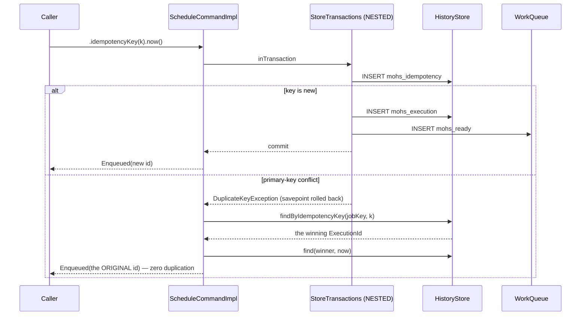

# Idempotency

Status: Active · Last Reviewed: 2026-08-29 · Source of Truth: Repository

Mohs implements the **Idempotent Receiver** pattern: a caller supplies a key, and a repeated request
carrying the same key returns the original receipt instead of creating a second execution.

## Using it

Java:

```java
Enqueued receipt = mohs.schedule(SEND_INVOICE, payload)
                       .idempotencyKey("invoice-2026-08-" + invoiceId)
                       .now();
```

REST:

```http
POST /api/mohs/v1/jobs/send-invoice/schedule
Idempotency-Key: invoice-2026-08-4711
Content-Type: application/json

{"payload": {"invoiceId": 4711}}
```

Both return `202 Accepted` with the same `executionId` on every repeat.

## The mechanism

Deduplication is scoped to **`(job_key, idempotency_key)`**, and the check *is* a primary-key
conflict — never a prior `SELECT`:

```sql
-- written FIRST, before any history row
INSERT INTO mohs_idempotency (job_key, idempotency_key, execution_id, created_at)
VALUES (:jobKey, :idempotencyKey, :executionId, :createdAt);
```



**The race is decided by the database, never by a prior read.** A check-then-insert would leave a
window between the two statements in which two nodes both see "not present".

## Why the idempotency insert comes first

It must abort the whole unit **before any history row is born**. If the execution row were written
first and the key conflicted afterwards, the rollback would still be correct — but the ordering
makes the intent explicit and keeps the conflict cheap.

## Why the transaction is `NESTED`

`JdbcStoreTransactions` uses `PROPAGATION_NESTED`, and that choice is what makes the whole pattern
composable inside a host transaction:

| Situation | Behaviour |
| --- | --- |
| No active transaction | Behaves like `REQUIRED`: opens and commits its own |
| Inside the host's `@Transactional` method | Becomes a **savepoint** |

Two concrete failures the savepoint prevents:

1. **On PostgreSQL, a constraint violation without a savepoint aborts the entire transaction**
   (`25P02`), so the recovery path that reads the winner would be unreachable — the connection is
   poisoned.
2. **With `REQUIRED`, the template's rollback-only flag would doom the host's commit** *after* Mohs
   had already returned a successful `Enqueued` to the caller.

The "joins and falls together" semantics are preserved: the unit only becomes durable when the
host's transaction commits.

## The deduplication window

| Property | Value |
| --- | --- |
| Scope | `(job_key, idempotency_key)` — the same key on two different jobs does not collide |
| Duration | **For as long as the row exists in `mohs_idempotency`** — which is `mohs.engine.idempotency-retention`, `7d` by default |
| Storage | A dedicated table, `PRIMARY KEY (job_key, idempotency_key)`, with `created_at` |
| Pruning | The engine's tick prunes hourly through `HistoryStore#pruneIdempotencyBefore(cutoff)`, served by `idx_mohs_idempotency_created` (measured 83.2 ms → 0.97 ms on 2 M rows). `mohs.engine.idempotency-retention=0s` opts out and keeps every key — and the table — forever |

Consequences to plan for:

- **Reusing an old key returns the old execution.** With no pruning scheduled, the window is
  effectively unbounded, so a key that encodes a recurring business period (`"daily-close"`) will
  deduplicate forever.
- **Design keys to be unique per intended unit of work** — include a date, a version, or the source
  record's identity.

## Batch and idempotency

The idempotency table exists in a separate table precisely so the uniqueness constraint is
independent of history's physical layout. Note the following about the batched write path:

- `HistoryStore#record` accepts a list. With N executions and **one** duplicated key, the **whole
  unit aborts** — per-item resolution is the caller's job (retrying without the duplicate), not the
  port's.
- Batch members are enqueued **without** idempotency keys (`MohsImpl#enqueueMembers` passes `null`).
  A batch's all-or-nothing creation is its own protection.

## What is deliberately not deduplicated

| Path | Deduplicated? | Why |
| --- | --- | --- |
| `Mohs.schedule(...).idempotencyKey(k)` | Yes | The explicit contract |
| `POST /jobs/{k}/schedule` with an `Idempotency-Key` header | Yes | Same mechanism |
| `POST /jobs/{k}/schedule` **without** the header | No | Nothing to deduplicate against |
| **Scheduler occurrences** | **No, deliberately** | The trigger's advance-and-insert is atomic, so a crash between them can neither lose nor duplicate an occurrence. A key here would be subject to a retention window; atomicity is not |
| **Batch members** | No | The batch's transaction is the protection |
| **Retries** | No | The same execution row is reused; nothing new is inserted |
| **Manual retry** | No | Same reason. Its natural idempotence is the CAS — repeating the POST finds the execution already rearmed and returns 409 naming the current state |

## Idempotency inside the handler

Mohs deduplicates **the request to schedule**, not the side effect. Because the delivery guarantee is
at-least-once, **a handler must be idempotent in its own right** for any operation that must not
happen twice:

| Situation causing a second invocation | Frequency |
| --- | --- |
| A retry after a failure | Normal operation |
| A reclaim after node death | Whenever a node dies mid-execution |
| A completion lost inside the group-commit window (up to 5 ms) during a crash | Rare |
| A zombie whose result is fenced out, then a re-execution elsewhere | Whenever a node stalls past its lease |

Recommended handler-side techniques, all outside Mohs' scope:

- A unique constraint on the business key of whatever is being written.
- An `UPSERT` / `MERGE` instead of an `INSERT`.
- The transactional outbox: write the business change **and** the follow-up job in one transaction.
- A conditional write against an external system that supports one.

`JobContext` exposes `executionId()` and `attempt()`, which are exactly the values needed for a
handler-side dedup key. Note that **the execution id is stable across retries** — the attempt number
is what changes.
