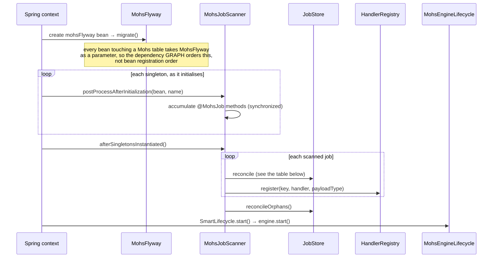

# Job definition and registration

Status: Active · Last Reviewed: 2026-08-29 · Source of Truth: Repository

**A job is defined once and invoked N ways.** Cron, `Mohs.schedule`, `Mohs.batch`, the dashboard and
the REST API are all *invocations*; none of them redefines policy. That principle is what makes the
whole surface small.

## Actors, inputs, outputs

| | |
| --- | --- |
| **Actors** | Application developer (declares); the boot process (registers); the operator (pauses, reschedules) |
| **Preconditions** | A Spring context; a `DataSource`; `mohs.jdbc.dialect` set |
| **Inputs** | `@MohsJob`-annotated methods on singleton beans, or `JobDefinition.of(...)` calls |
| **Outputs** | Rows in `mohs_job_definitions`; entries in the in-memory `HandlerRegistry` |
| **Side effects** | Definitions that disappeared from the code are marked `ORPHANED` |
| **Errors** | Duplicate id; two job annotations on one method; blank id; unsupported signature; `@OnExecution` present; identity collision with a programmatic definition; definitional drift under `on-conflict=fail` |

## Path 1 — the annotation

```java
@Component
class Invoices {

    @RecurringJob(id = "nightly-invoices", cron = "0 0 3 * * *", zone = "America/Sao_Paulo",
                  runner = "io", retries = 3, timeout = "PT10M")
    void nightly() { /* ... */ }

    @OnDemandJob(id = "send-invoice", rateLimit = "smtp")
    void send(SendInvoice payload, JobContext ctx) { /* ... */ }
}
```

Three annotation forms exist, and all three resolve to exactly one `JobDefinition`:

| Form | For | Trigger attributes | Notes |
| --- | --- | --- | --- |
| `@MohsJob` | The general case | `cron`+`zone`, `every`, `everyAfterFinish` — mutually exclusive; all absent means on-demand | |
| `@RecurringJob` | A job that fires by itself | Exactly one is **required** | The occurrence carries no payload, so the handler cannot demand a typed one (validated at boot). A `Map` or `Object` parameter is allowed: an automatic firing delivers an empty map, while a manual invocation may carry data |
| `@OnDemandJob` | A job invoked only explicitly | None exposed | Also omits `misfire` (there is no firing to miss) and `startPaused` (pausing does not affect manual invocation) |

`@RecurringJob` and `@OnDemandJob` are **meta-annotated with `@MohsJob`**, each attribute an
`@AliasFor` of its counterpart — the same design as Spring's `@Service` over `@Component`. Because
`@MohsJob` targets `ANNOTATION_TYPE`, a consumer can compose their own stereotype and the scanner
resolves it through merged annotations.

### Handler signatures

Resolved by `MohsJobs.ParameterBinding.of`. The rule: **at most one payload and at most one
`JobContext`, both optional, in any order.**

| Signature | Valid | Payload type seen by REST |
| --- | --- | --- |
| `void run()` | Yes | none |
| `void run(MyPayload p)` | Yes | `MyPayload` |
| `void run(JobContext ctx)` | Yes | none |
| `void run(MyPayload p, JobContext ctx)` | Yes | `MyPayload` |
| `void run(JobContext ctx, MyPayload p)` | Yes | `MyPayload` |
| `void run(A a, B b)` | **No** — two non-`JobContext` parameters | |
| `void run(JobContext a, JobContext b)` | **No** | |
| Three or more parameters | **No** | |

Each rejection throws at boot with a message naming the declaring method and the reason. The payload
type matters beyond the handler: `Mohs.payloadType(jobKey)` exposes it so the REST layer can convert
a JSON body into the real type before scheduling, rather than persisting a raw `Map` the handler
cannot consume. A handler registered manually (via `HandlerRegistry#register` without a type) is
treated by REST as a job that accepts no payload.

### Checked exceptions and error fidelity

`InvocationTargetException` is unwrapped, so `Attempt.error` records the **original** exception's
message rather than the string `"InvocationTargetException"`. A raw `IllegalArgumentException` from
reflection — a payload of a type the parameter does not accept, where the method never even ran — is
wrapped with a message naming the method, the payload's actual class and the parameter's expected
class.

## Path 2 — programmatic

For dynamic, data-driven registration (per-tenant schedules, for instance):

```java
mohs.define(JobDefinition.of("tenant-42-sync", TenantSync.class,
        spec -> spec.cron("0 */5 * * * *", ZoneId.of("UTC"))
                    .runner("io")
                    .retries(5)
                    .preventOverlap()));
```

The builder is **staged**: `JobSpec` exposes only the four trigger methods and each returns
`PolicySpec`, which does not expose them again. "Cron *and* every" is therefore unrepresentable at
compile time rather than a validation error at boot. Both interfaces are `sealed` to a single
implementation, which is what lets them gain methods in minor releases without breaking binary
compatibility.

`PolicySpec` methods: `runner`, `window`, `rateLimit`, `misfire`, `startPaused`, `preventOverlap`,
`maxConcurrentExecutions(int)`, `retries(int)`, `timeout`, `retryPolicy`.

Note that `JobDefinition.of` always produces `source = PROGRAMMATIC` and `name = null`.
`ANNOTATION` definitions can only be produced by something that actually scanned an annotation.

## The registration sequence at boot



Two phases, mirroring Spring's own `ScheduledAnnotationBeanPostProcessor`: **accumulate** while each
bean initialises, **commit** only once every singleton exists. Without that, bean creation order
would arbitrarily decide which `@MohsJob` wins an id conflict.

Three details that are load-bearing:

- **`ObjectProvider` for every dependency.** A `BeanPostProcessor` with an ordinary constructor
  dependency forces Spring to create that dependency too early, before all post-processors are
  registered — Spring itself warns about it. `ObjectProvider` defers resolution to
  `afterSingletonsInstantiated`, where the problem no longer exists.
- **The scanned map is `synchronized`.** With Spring Framework 6.2+ background bootstrap,
  `postProcessAfterInitialization` can run on concurrent threads in the host application, and an
  embedded library does not control that.
- **`containsBean` before `isSingleton`.** Not every object passing through post-processing is a
  context bean: Spring initialises a `View` by view *name*, so `setViewName("forward:/x")` arrives
  as the bean name `"forward:"`. Without the guard, `isSingleton` throws and any host with a
  `forward:`/`redirect:` view broke merely by having Mohs on the classpath.

## Reconciliation rules

| Situation | Outcome | Governed by `on-conflict`? |
| --- | --- | --- |
| Job not in the store | Upsert | No |
| Stored definition is `PROGRAMMATIC`, incoming is `ANNOTATION` | **Always fails** — an identity collision, not drift | No |
| Two `@MohsJob` methods share an id | **Always fails** at scan time, naming both methods | No |
| One method carries more than one job annotation (directly or via a composed stereotype) | **Always fails** | No |
| Stored equals incoming | Upsert (a no-op refresh that also clears `orphaned`) | No |
| Stored differs from incoming, both `ANNOTATION` | Depends | **Yes** |

The `mohs.registration.on-conflict` values:

| Value | Behaviour |
| --- | --- |
| `override` (default) | Code wins. The change is logged at INFO with a field-by-field diff |
| `preserve` | The store wins. The code's version is ignored, logged at WARN with the diff |
| `fail` | Boot fails, showing the diff |

The "more than one job annotation" check counts appearances of `@MohsJob` across the merged
annotation graph rather than counting the three direct forms — because counting direct forms let
"composed + direct" through, to be resolved silently by *declaration order in the source*, which is
exactly the arbitrariness the scanner exists to prevent.

## Orphaning and retirement

Two different mechanisms, for two different sources:

| | `ORPHANED` | Retired |
| --- | --- | --- |
| Applies to | `ANNOTATION` definitions only | `PROGRAMMATIC` definitions only |
| Trigger | The annotation disappeared from the code; the next boot's scan does not find it | An explicit `Mohs.remove(jobKey)` |
| Effect | The job stops firing. The row and all history remain | The queue is drained (enqueued entries become `CANCELLED`), the row is flagged `retired`, and the job disappears from `find`/`findAll` |
| Reversible | Yes — restoring the annotation clears the flag on the next boot (the source reappearing is proof of life) | Yes — an upsert of the same `job_key` resurrects the definition |
| Calling `Mohs.remove` on the other kind | Throws `IllegalArgumentException` telling you to remove the annotation instead | — |

Orphan reconciliation reads only `ANNOTATION`-sourced definitions (`findAllAnnotationSourced`), and
collects the keys to a list **before** writing — never writing with a read cursor still open on the
same connection.

## What `startPaused` does, and does not, do

`startPaused = true` means the job is **born** paused: the schedule is declared but disarmed until a
`resume`. Manual on-demand execution still works while paused.

After birth, `paused` belongs exclusively to the operator. A redeploy never re-pauses — `JobStore#upsert`
initialises `paused` only on the *first* registration. This is the general rule stated concretely:
an upsert writes definitional state and never touches operational state.

## Definitional vs. operational state

| Definitional (written by upsert) | Operational (never written by upsert) |
| --- | --- |
| `job_key`, `name`, `handler_type` | `paused` (except at birth) |
| `schedule_type`, `cron_expression`, `cron_zone`, `interval_duration`, `interval_after_finish` | `orphaned` (except: an upsert *clears* it) |
| `runner`, `window_name`, `rate_limit` | `retired` |
| `misfire`, `start_paused` | `next_fire_at` (except when the schedule itself changed) |
| `allow_concurrent_executions`, `max_concurrent_executions` | |
| `retries`, `timeout`, `retry_policy`, `source` | |

The `next_fire_at` rule is subtle and worth stating exactly: **preserving means not writing the
column**, never rewriting the value that was read. Rewriting would be a lost update against the
firing CAS and against the completion's fixed-delay rearm. A new or altered schedule *does* rearm,
recomputed from the clock, in the same write.

An unchanged recurring schedule with a disarmed trigger is **healed** (rearmed) — and for
fixed-delay, only when there is no live scheduler occurrence.
