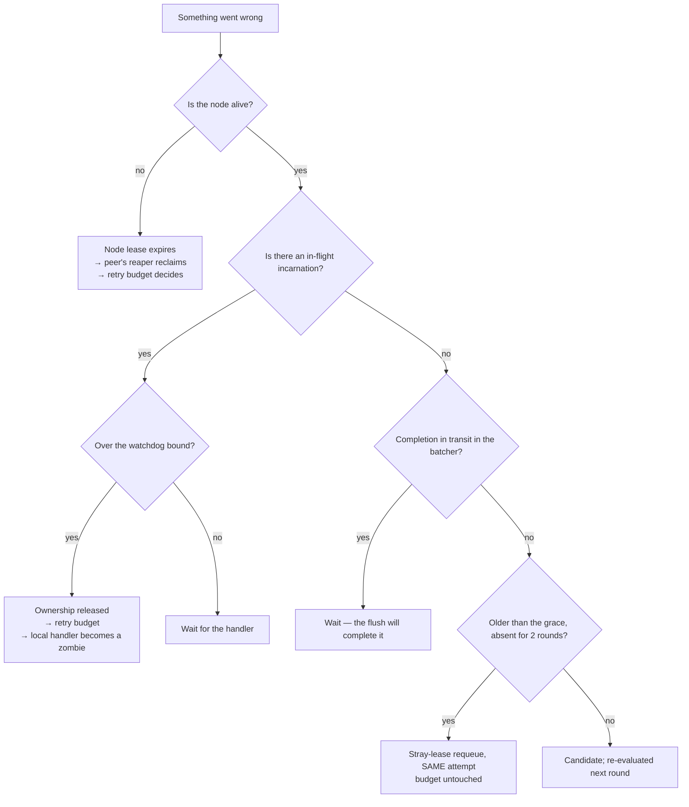

# Resilience

Status: Active · Last Reviewed: 2026-09-04 · Source of Truth: Repository

Every resilience mechanism in Mohs, and the specific failure each one protects against.

## The mechanism inventory

| Mechanism | Protects against | Configuration | Default |
| --- | --- | --- | --- |
| Retry with exponential backoff and full jitter | A transient handler or downstream failure | `retries` per job | 1 |
| Adaptive poll backoff | Hammering a degraded database; idle cost | `poll-interval`, `max-poll-interval` | 25 ms → 2 s |
| Claim bounded by dispatch headroom | A node claiming what it cannot run | `dispatch-concurrency` | 64 |
| Executor rejection (never an unbounded queue) | Unbounded memory growth under load | Runner `maxConcurrent` / `queueCapacity` | 64 / 0 |
| Completion-batcher blocking submit | Persisting slower than executing | `flushSize × 4` queue | 1,024 |
| Node lease + reaper | A node dying mid-execution | `node-lease-ttl` | 15 s |
| Fencing token `(node_id, epoch, attempt)` | A revived zombie corrupting state | — | Always on |
| Stray-lease reconcile | Work lost between claim and dispatch on a **live** node | Derived: `max(2s, 4 × poll-interval)` | — |
| Watchdog bound | A handler deaf to interrupts | `watchdog-timeout` | **off** |
| Graceful drain + escalation | Losing in-flight work on shutdown | `lifecycle.shutdown.grace-period` | 30 s |
| Per-step tick isolation | One broken maintenance step stopping the claim | — | Always on |
| Rate-limit statement timeout | One stuck node stalling every other node's heartbeat | `BUCKET_LOCK_TIMEOUT` | 2 s (internal) |
| Tick statement timeout | A statement on the loop thread waiting out the node's own lease | `TICK_STATEMENT_TIMEOUT_SECONDS` | 3 s (internal) — the heartbeat, the reaper's and reconcile's reads, the cancel poll, the firing CAS, the claim and the requeue |
| Idle-gate fail-open | A failing probe silently stalling a node | — | Always on |
| Inadmissible-filter truncation | Losing a guard when the list exceeds the parameter ceiling | `MAX_INADMISSIBLE_FILTER` | 1,000 (internal) |
| Firing and reclaim caps | An unbounded sweep after downtime or mass death | `FIRE_LIMIT`, `RECLAIM_LIMIT` | 500 each (internal); reclaims commit in chunks of `RECLAIM_CHUNK` = 50, each its own transaction under the tick's deadline, and both sweeps stop at the tick's `node-lease-ttl / 4` budget |
| Misfire replay cap | A pathological schedule turning one tick into an unbounded insert | `MAX_OCCURRENCES_PER_CYCLE` | 1,440 (internal) |
| Cron expression cache ceiling | Operator-driven unbounded map growth | `MAX_CACHED_EXPRESSIONS` | 10,000 (internal) |
| `onCompletion` LRU ceiling | Callback registrations resident forever in a cluster | `MAX_TRACKED_BATCHES` | 10,000 (internal) |
| SSE subscriber cap | Amplification against an unauthenticated endpoint | `MAX_SUBSCRIBERS` | 64 (internal) |
| Snapshot-read deadline | A hung read freezing the SSE timer forever | `STREAM_INTERVAL` + `FRAME_CANCEL_GRACE` | 2 s + 1 s (internal) |

## Backoff, in detail

Two different backoffs exist, for two different purposes:

| | Retry backoff | Poll backoff |
| --- | --- | --- |
| Purpose | Do not stampede a recovering downstream | Do not hammer an idle or degraded database |
| Shape | Full jitter: `Uniform[0, min(1s × 2^(n−1), 10min)]` | Deterministic doubling from `poll-interval` to `max-poll-interval` |
| Reset | New execution | The first tick that finds work |
| Jitter | **Yes** — the 3 a.m. case is a shared resource going down and taking many executions with it; without jitter they all come back in lockstep | No — a single node's cadence needs no de-correlation |

A failing tick returns `TickOutcome.idle()`, so **a failure backs off exactly like an empty queue**:
a database that is down does not improve by being hammered at the 25 ms floor.

## Timeouts

| Timeout | Scope | Effect on expiry |
| --- | --- | --- |
| Job `timeout` | One attempt, from the handler's real start | Flag + interrupt |
| `watchdog-timeout` | One dispatch, from the submit (queue time counts) | Ownership released through the retry budget |
| `node-lease-ttl` | The node's liveness promise | Peers may reclaim its work |
| Drain grace | Shutdown | Flag + interrupt on everything in flight |
| Rate-limit statement timeout (2 s) | One `charge` | `QueryTimeoutException`; the claim round is lost, the heartbeat is not |
| Tick statement timeout (3 s) | One lock-waiting statement the loop thread issues, or one chunk of the reaper's completion (50 reclaims per transaction) | `QueryTimeoutException`, or `TransactionTimedOutException` when the reaper's deadline runs out between statements; the tick step is lost and counted in `mohs.tick.failed` (under `step=tick` when the death is outside a maintenance step), the lease is not — a quarter of the 12 s floor on `node-lease-ttl`. The definition scans (rows, not locks) and host-thread statements (enqueue, completion flush, history reads) carry no ceiling; `GET /nodes` shares the heartbeat's |
| Firing sweep budget (`node-lease-ttl / 4`) | One tick's trigger sweep | The sweep stops after the trigger that spent the budget and logs a WARN naming how many wait; they fire next tick. Up to 500 CASes at 3 s each would otherwise outlast the lease when a host transaction holds a few definition rows |
| SSE snapshot deadline (2 s) | One `buildFrames` | `IllegalStateException` → the tick logs and retries next time |
| SSE scope quiescence (1 s) | Cancelling snapshot subtasks | A leaked-reader WARN, never an unbounded wait |
| Loop join on stop (`node-lease-ttl / 4`) | Waiting for the current tick | A WARN naming the degraded mode; shutdown continues |
| Completion drain on stop | The remaining flush budget, floor 1 s | Best-effort |

**Every wait has a deadline.** There is no unbounded `join()`, no unbounded `await()`, and no
unbounded `get()` in the tree.

## Bulkheads

| Bulkhead | Isolates |
| --- | --- |
| Named runners | One job family's saturation from another's — a slow `io` job cannot starve `cpu` work if they are on different runners |
| `dispatch-concurrency` | The node from the cluster's backlog |
| Per-job `maxConcurrentExecutions` | One job from monopolising the cluster |
| Rate limits | An external resource from the cluster |
| Execution windows | A time period from the cluster |
| Sharding | One node's claim from another's — 1/n of the queue each, so they rarely contend |
| Event executor (16) separate from runners | Listener storms from execution capacity |
| Per-step tick isolation | Maintenance from the claim |

## Fallbacks

Each fallback is chosen so that **degradation is monotonic** — the fallback is never worse than the
thing it replaces:

| Situation | Fallback | Why it is safe |
| --- | --- | --- |
| Idle-gate probe throws | Run the full claim lap | `true` is always safe; it costs a lap |
| Inadmissible list exceeds 1,000 | **Truncate** the filter, do not drop it | The post-claim `admit` is the authority; dropping it caused a measured requeue livelock |
| Definitions snapshot misses a job | Fresh single-row query, memoised into the snapshot | Cost falls only on a miss — newborn or removed, never the hot path |
| Group-commit flush fails | One transaction per result | A result is never discarded because of its neighbours |
| Individual completion fails | Leave the lease; the reaper resolves it | Indistinguishable from a crash before completion — the honest path |
| Completion batcher thread dies | `submit` degrades to the synchronous path | Set in a `finally`, so any exit route is covered |
| Node row lacks `expires_at` (older jar) | Fall back to heartbeat staleness against `lease-ttl` | Mixed-version tolerance |
| No Micrometer registry in the host | A local `SimpleMeterRegistry` | The engine stays identical, with no conditional path in hot code |
| Boot-time policy check throws | WARN with the full cause; the engine starts | Diagnostics never bring the boot down |
| Final `STOPPED` heartbeat fails | Best-effort; staleness and the purge cover it | A shutdown never fails because the database is down |
| Client route requested under `/mohs-ui/**` (anything outside `assets/`) | Serve `index.html` | Refreshing on a client route resolves instead of 404ing. A missing file under `assets/` is a plain 404: a browser with a stale page after a deploy must learn its script is gone, not receive HTML in its place |

## Recovery procedures the system performs itself

## Chaos scenarios, and their measured results

`mohs-benchmark/scripts/chaos-recovery.ps1` plus `ScenarioCluster`-based tests. Results recorded
2026-08-22 and 2026-08-23 on a single-machine PostgreSQL container; environment-specific, but the
**correctness** verdicts are the point.

| Scenario | Injection | Pass criterion | Recorded result |
| --- | --- | --- | --- |
| `S6` | `kill -9` a node mid-drain | 100% of the seed reaches a terminal state; re-executions only for what was `RUNNING` at the kill | 50,000 terminal; 827 re-executions = exactly the `RUNNING` set; 0 outside it; kill→finish 19.6 s (reclaim wave at 15.4 s — the lease floor); 0 exception lines |
| `SUSPEND` | Freeze one node longer than `node-lease-ttl`, then resume | Seed fully terminal; reclaim actually happened; **zero** executions with more than one `SUCCEEDED` attempt | 50,000 terminal; 244 reclaimed while frozen; **0 double completions**; 1 epoch-bump WARN on resume; resume→finish 14.6 s |
| `S8` | `docker pause` the database for 30 s mid-drain | No loss, no exception storm, drain resumes, no self-reap | 50,000 terminal; **0 re-executions**; first completion 259 ms after unpause; 24,109 completions in the following 10 s; 0 exceptions |
| `NodeChurnScenario` | A node leaves via `stop(grace)`; a new one joins mid-drain | No loss; redelivery bounded to what was in flight; the departed node's shards are claimed again | Asserted in-test |
| `RollingUpdateScenario` | A deploy adds a job; part of the cluster lacks the handler | (a) work survives when the rollout finishes within the budget; (b) the cost of a permanently blind node is asserted at the value it **has** | Asserted in-test |

### A declared limitation of the `SUSPEND` scenario

Recorded in the script: if the freeze catches the node **mid-claim-transaction**, the batch's rows
stay locked-but-uncommitted — invisible to the reaper (not `RUNNING`) and skipped by other claims
(`SKIP LOCKED`) until the frozen session ends. A run reporting "reclaimed: 0" with a full drain
right after resume is *that* mode, not a fence failure. It is a pre-existing property, and the
database-side mitigation is `idle_in_transaction_session_timeout`.

## What is deliberately absent

| Mechanism | Why not |
| --- | --- |
| **Circuit breaker** over the database | There is one downstream, and the adaptive backoff plus per-step isolation already covers degradation. Opening a breaker would stop the heartbeat — which is exactly what must not stop, since a stopped heartbeat means peers reclaim work that is still running here |
| **Dead-letter queue** | Exhausted retries become terminal `FAILED` rows in history, queryable and manually retryable. A separate DLQ table would be a second place to look |
| **Priority aging** | `BACKGROUND` can starve under sustained higher-priority load. Documented as a known risk in `Priority`'s Javadoc rather than silently mitigated |
| **Cross-node `onCompletion` delivery** | Explicitly out of contract; the outbox pattern is prescribed instead |
| **Load shedding at the API** | The REST layer has no rate limiting of its own beyond the SSE subscriber cap |
