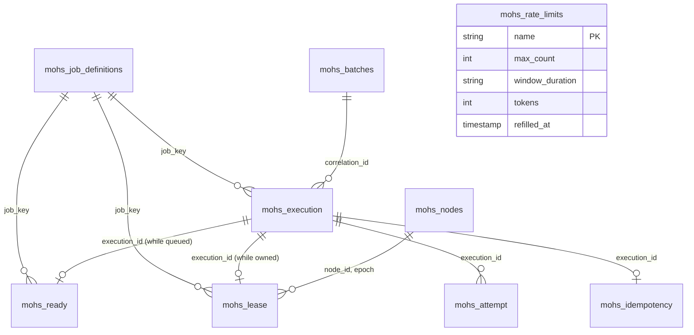

# Data model

Status: Active · Last Reviewed: 2026-09-04 · Source of Truth: Repository (`mohs-store-jdbc/src/main/resources`)

## The nine tables

Every table carries the `mohs_` prefix, because Mohs is an **embedded library sharing the host
application's database and schema**.

> **No foreign keys are declared** on the split tables. The relationships above are logical. The
> only declared FKs in the tree were on the legacy single-table schema, dropped in `V4`.

## The four write profiles

The table split exists because four *shapes of write* exist, and mixing them made the hottest table
pay for the coldest.

| Table | Write profile | Size proportional to | Read on the hot path? |
| --- | --- | --- | --- |
| `mohs_ready` | INSERT on enqueue/retry/requeue, DELETE on claim | **The backlog** | Yes — the claim |
| `mohs_lease` | INSERT on claim, DELETE on completion | **Work executing across the cluster** (`nodes × dispatch-concurrency`) — thousands of rows, never millions | Yes — the cap, the reaper, the cancel poll |
| `mohs_execution` | One INSERT at birth, one UPDATE at terminal | Grows forever | Once per claim round (a batched payload read) |
| `mohs_attempt` | Append-only | Grows forever | No — only the detail view and the throughput window |

The operationally important consequence: **history size does not affect claim cost**, because the
claim statement references only `mohs_ready` and `mohs_lease`. This was measured as a release gate —
throughput flat between ~0 and 2 M history rows in a clean A/B on the same binary and session.

The `mohs_lease` size bound is what makes the derived concurrency cap (`countByJob`) an index scan
that is always cached, and what allowed a hot per-job `running_execution_count` counter to be
deleted entirely (`V4`).

## The control plane

Three tables that are read often and written rarely:

| Table | Rows | Written by |
| --- | --- | --- |
| `mohs_job_definitions` | One per job | Boot upsert; pause/resume; reschedule; the firing CAS; the fixed-delay rearm |
| `mohs_rate_limits` | One per declared limit | Boot upsert; `charge` on the claim path; `PATCH` |
| `mohs_nodes` | One per node incarnation | One heartbeat per node per tick; the stale purge |
| `mohs_batches` | One per batch | Insert at creation; one atomic increment per member completion |

## Table reference

### `mohs_job_definitions`

The definition, plus the operational state deliberately kept separate from it.

| Column | Type (PostgreSQL) | Notes |
| --- | --- | --- |
| `id` | `VARCHAR(255)` PK | UUIDv7 |
| `job_key` | `VARCHAR(255)` **UNIQUE** | The domain identity |
| `name` | `VARCHAR(255)` | Optional display label |
| `handler_type` | `VARCHAR(500)` | The declaring class's name — never a CGLIB proxy name, which would not resolve stably across restarts |
| `schedule_type` | `VARCHAR(20)` | `CRON` / `INTERVAL` / `ON_DEMAND` |
| `cron_expression`, `cron_zone` | | Populated for `CRON` |
| `interval_duration`, `interval_after_finish` | | Populated for `INTERVAL`. The duration is an ISO-8601 string |
| `runner`, `window_name`, `rate_limit` | `VARCHAR(255)` | References **by name** |
| `misfire` | `VARCHAR(20)` | |
| `start_paused` | boolean | **Definitional** — read only at first registration |
| `allow_concurrent_executions`, `max_concurrent_executions` | | The second is non-zero only when the first is false |
| `retries`, `timeout`, `retry_policy` | | `timeout` is an ISO-8601 string; `retry_policy` names the `RetryPolicy` bean consulted on failure |
| `source` | `VARCHAR(20)` | `ANNOTATION` / `PROGRAMMATIC` |
| `orphaned` | boolean | **Operational** |
| `paused` | boolean | **Operational** |
| `retired` | boolean | **Operational** — soft retire; the row and history survive |
| `next_fire_at` | timestamp, nullable | **The trigger's state.** `NULL` = nothing to fire: on-demand, or fixed-delay awaiting a completion |
| `created_at`, `updated_at` | timestamp | From the injected `Clock` |

### `mohs_ready` — the queue

| Column | Notes |
| --- | --- |
| `execution_id` PK | |
| `job_key` | Used by the claim's `NOT IN` admission filter |
| `shard` `SMALLINT` | `FNV-1a(execution_id) mod 64` — a **function of the id**, re-derived everywhere, not transported state |
| `priority` `INT` | Default 20 (`NORMAL`). Lower claims first |
| `attempt` `INT` | The attempt this entry **will become** once claimed. Nothing else counts attempts on the hot path |
| `visible_at` | The single admission rule: `visible_at <= now` |

On PostgreSQL the table carries `fillfactor = 70` and aggressive autovacuum settings
(`autovacuum_vacuum_scale_factor = 0.0`, `threshold = 1000`, `cost_delay = 0`) — it is
insert/delete churn, and the defaults would let dead tuples accumulate faster than the vacuum
collects them.

### `mohs_lease` — ownership

| Column | Notes |
| --- | --- |
| `execution_id` PK | |
| `job_key` | Serves the derived concurrency cap |
| `node_id`, `epoch` | **The fencing token.** Every write over owned work carries the pair |
| `attempt_number` | Copied from the queue entry at claim time |
| `priority` | Travels queue → ownership so the reaper can rebuild a requeue entry **without reading history** |
| `claimed_at` | The stray-lease grace measures against it |
| `cancel_requested` | The cooperative cancel flag. It lives here, so it dies with the lease |

Same PostgreSQL storage parameters as `mohs_ready`, for the same reason.

### `mohs_execution` — history

| Column | Notes |
| --- | --- |
| `execution_id` | PK on H2/MySQL/SQL Server. On **PostgreSQL** the PK is `(created_at, execution_id)` |
| `job_key`, `shard`, `priority` | |
| `state` | **Advisory**: `PENDING` from birth until a terminal write |
| `scheduled_at` | When it was due |
| `created_at` | When the row was **born**. In a `FIRE_ALL_MISSED` replay this differs from `scheduled_at` — history would otherwise record a birth that did not happen then |
| `finished_at` | Written by the terminal update |
| `actor` | |
| `correlation_id` | Carries the `batchId` until it is generalised |
| `idempotency_key` | Denormalised for reads; uniqueness lives in `mohs_idempotency` |
| `payload`, `payload_type` | JSON plus the concrete class name. `TEXT` on PostgreSQL/H2, `MEDIUMTEXT` on MySQL, `NVARCHAR(MAX)` on SQL Server — **never `CLOB`**, which PostgreSQL does not have |

**The PostgreSQL PK ordering is a historical artefact**, and it is documented as such: `created_at`
had to lead because it was the partition key. Partitioning was removed in `V5`; the PK was left
alone because normalising it would touch the hot terminal-update path without a measurement
justifying it. `created_at` therefore travels in memory from the payload read to the completion, so
the terminal `UPDATE` can match the row by equality on both columns.

### `mohs_attempt` — the append-only attempt log

| Column | Notes |
| --- | --- |
| `execution_id`, `number` | PK on H2/MySQL/SQL Server. On **PostgreSQL** the PK is `(finished_at, execution_id, number)` — the same partitioning artefact |
| `node_id` | **Forensics: which node executed this attempt** |
| `started_at`, `finished_at` | |
| `outcome` | `SUCCEEDED` / `FAILED` / `CANCELLED` — never `ENQUEUED` or `RETRY_WAITING`, which describe the owning execution |
| `error_type` | The exception's class name — the number-one operational query |
| `error` | The exception's **message** only, never the stack trace — and at most 256 KB of it, the tail replaced by `… [truncated N chars]` |

### `mohs_idempotency`

| Column | Notes |
| --- | --- |
| `job_key`, `idempotency_key` | PK. **The primary-key conflict *is* the deduplication check** |
| `execution_id` | The winner of the race |
| `created_at` | Pruned by the idempotency window, not by history retention |

A separate table because the uniqueness must be independent of history's physical layout.

**SQL Server diverges here**, and the reason is a hard limit rather than a preference: with
`NVARCHAR` the key measures `2 × (255 × 2) = 1020` bytes, above the 900-byte ceiling for a
**clustered** index (the non-clustered ceiling rose to 1700 in 2016+; the clustered one did not).
Measured: 225+225 characters inserts, 256+255 fails with `Msg 1946` at enqueue time. So the PK is
`NONCLUSTERED` and the clustered index is `created_at`.

That choice is not neutral, and both sides are recorded. **For**: `created_at` is monotonic (from
the injected clock), so inserts stay at the tail and the retention prune becomes a range delete on
the clustered index itself — which is why this dialect does **not** carry
`idx_mohs_idempotency_created`. **Against**: the insert now maintains two structures, the dedup
`SELECT` becomes a seek plus key lookup, and the same monotonicity concentrates every node on the
last page (`PAGELATCH_EX`). The change was mandatory; the net balance has not yet been measured.

### `mohs_rate_limits`

| Column | Notes |
| --- | --- |
| `name` PK | |
| `max_count`, `window_duration` | The spec. The window is an ISO-8601 string |
| `tokens` | The bucket's balance **as of the last charge** |
| `refilled_at` | The instant up to which time has already become tokens. The refill is applied **in memory at read time** |

### `mohs_nodes`

| Column | Notes |
| --- | --- |
| `node_id` PK | A UUIDv7 generated per `Engine` instance — a restart is a new node |
| `state` | `CREATED` / `RUNNING` / `PAUSED` / `DRAINING` / `STOPPED` |
| `last_heartbeat_at` | |
| `epoch` `BIGINT` | The node's incarnation |
| `expires_at`, nullable | **The node lease.** `NULL` only on a row written by an older jar, in which case the reaper falls back to heartbeat staleness |

### `mohs_batches`

| Column | Notes |
| --- | --- |
| `id` PK | |
| `name` `NOT NULL` | The caller's label. Durable data — an operator must be able to tie a batch back to intent |
| `total`, `succeeded`, `failed` | `pending` is **derived, never stored** |
| `created_at` | |

### The table that is not there

Mohs used to keep `mohs_schema_history` for its own migration engine. Both are gone: the library
executes no DDL, so nothing records which schema versions a database has seen — **that is now yours
to track**. See [installing and upgrading the schema](migrations.md).

## Key strategy

| Rule | Enforcement |
| --- | --- |
| Every generated PK is **UUIDv7** (`io.github.robsonkades:uuidv7`) | `KeyGenerationScanTest` in `mohs-store-jdbc` forbids `randomUUID` outside the UUIDv7 library in that module's sources; elsewhere it is convention |
| No `IDENTITY`, `SERIAL`, `AUTO_INCREMENT`, `SEQUENCE` anywhere | The same scan reads every `.sql` in the store and fails on any of them |
| Natural keys are fine | `job_key`, `rate_limits.name`, `mohs_attempt.number` |
| Ids are stored as `VARCHAR(255)` / `NVARCHAR(255)`, not a native UUID type | Portability across four dialects |

Why UUIDv7 rather than v4: it is **time-ordered**, so inserts stay localised at the index tail on
the system's hottest table, and it is lexicographically sortable as a string — which is what makes
keyset pagination by id chronological.

## Type mapping across dialects

| Concept | PostgreSQL | H2 | MySQL | SQL Server |
| --- | --- | --- | --- | --- |
| Identifier / short text | `VARCHAR` | `VARCHAR` | `VARCHAR` | **`NVARCHAR`** (`VARCHAR` is not Unicode by default) |
| Long text | `TEXT` | `TEXT` | `MEDIUMTEXT` | `NVARCHAR(MAX)` |
| Boolean | `BOOLEAN` | `BOOLEAN` | `BOOLEAN` | **`BIT`** (compared against `1`, never `TRUE`) |
| Control-plane timestamp | `TIMESTAMP` | `TIMESTAMP` | `DATETIME(6)` | **`DATETIME2`** (`TIMESTAMP` in T-SQL is `ROWVERSION`, a binary counter) |
| Split-table timestamp | **`TIMESTAMPTZ`** | `TIMESTAMP` | `DATETIME(6)` | `DATETIME2` |

## The temporal contract

**Every temporal column stores the wall clock in UTC.** The crossing is `LocalDateTime` (or
`OffsetDateTime` for PostgreSQL's `TIMESTAMPTZ`) via JDBC 4.2 `setObject`/`getObject` — **never**
`java.sql.Timestamp`.

The reason is a reproduced defect. The legacy path converted through the **JVM's default zone** at
both ends. The constant offset cancelled out within one JVM, but the **daylight-saving gap did
not**: `Timestamp.valueOf` resolves a nonexistent `LocalDateTime` by pushing it forward, so during
the gap hour every instant written came out an hour wrong. In `refilled_at` that means an apparently
empty token bucket — a burst above the limit, which is precisely the failure the rate limit exists
to prevent.

`LocalDateTime` consults no zone at all: the UTC wall clock crosses verbatim in all four dialects,
and the two conversion functions are inverses at **every** instant, gap included.

For PostgreSQL's tz-aware split tables the crossing is `OffsetDateTime` in UTC — a `LocalDateTime`
against a tz-aware column would be interpreted in the **session's** zone, which is exactly the class
of bug the zoneless crossing killed.

**Why not `timestamptz` everywhere**: MySQL makes uniformity impossible — its `TIMESTAMP` ends in
2038, which is unacceptable for a scheduler's `next_fire_at`. The newer tables are born tz-aware
where the dialect supports it.
