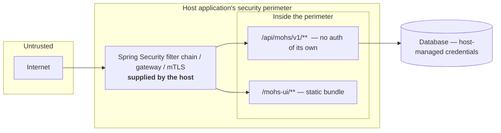

# Security overview

Status: Active · Last Reviewed: 2026-09-05 · Source of Truth: Repository

> **The single most important fact: the Mohs REST API and dashboard perform no authentication and no
> authorization.** The host application's security configuration is the only protection. This is a
> deliberate v1 design decision, and it is signalled by a WARN at every boot when the API is enabled.

## What exists, and what does not

| Control | Status |
| --- | --- |
| Authentication | **Not present** |
| Authorization / roles / permissions | **Not present** |
| Attribution for the audit trail | **Present** — `ActorResolver`, default `X-Mohs-Actor` header based |
| Input validation | **Present** — comprehensive, at the boundary |
| Injection resistance | **Present** — every query is parameterised |
| Secrets in configuration | **None to protect** — Mohs reads no credential of its own |
| TLS termination | The **host's** concern |
| Security headers | The **host's** concern |
| Rate limiting on the API | **Not present** (a 64-subscriber cap on SSE is the only limit) |
| CSRF protection | The host's `SecurityFilterChain`, if configured — needed only when the browser attaches the credential itself (a session cookie); see "Securing it" |
| CORS | Not configured by Mohs |
| Audit log | **Present** — `actor` is persisted per execution; runtime mutations log at INFO with the actor |
| Data at rest encryption | The database's concern |
| Payload encryption | **Not present** — payloads are stored as plaintext JSON |

## The trust model



Mohs relies on the host security perimeter and on control of the shared database. It does not add
an authentication boundary of its own.

## What an unauthenticated caller can do

If `/api/mohs/v1/**` is reachable, the caller can:

| Action | Impact |
| --- | --- |
| `POST /jobs/{k}/schedule` | Invoke **any** registered job with **any** payload |
| `POST /jobs/{k}/pause` | Stop a job firing cluster-wide, indefinitely |
| `POST /executions/{id}/cancel` | Cancel work in flight |
| `POST /executions/{id}/retry` | Re-run failed work, bypassing the retry budget |
| `PATCH /jobs/{k}/schedule` | Change when a job runs, cluster-wide |
| `PATCH /rate-limits/{n}` | Change throughput against an external resource, cluster-wide |
| `GET /executions/{id}` | Read execution metadata, actors, error messages and attempt history |
| `GET /jobs` | Enumerate every job, its handler class name and its schedule |
| `GET /nodes` | Enumerate the cluster |
| `GET /overview/stream` | Hold an SSE connection (capped at 64 concurrent) |

The boot WARN states this in the operator's own words:

> `mohs.api.enabled=true: the operational API is served at /api/mohs/v1 with NO authentication. It
> can trigger any registered job with a caller-supplied payload, cancel and retry executions, pause,
> resume and reschedule jobs, and change rate limits. Restrict it to an internal network, or put a
> gateway/mTLS in front of /api/mohs/v1 and /mohs-ui before exposing this instance.`

Note also that `GET /jobs` returns `handlerType`, a fully qualified class name. Payload conversion
failures use a controlled 422 response and do not expose Jackson diagnostics, Java class names or
rejected values.

## Securing it — the recommended pattern

Mohs' paths are ordinary paths in the host's servlet container, so the host's `SecurityFilterChain`
covers them:

```java
@Bean
SecurityFilterChain mohsOperations(HttpSecurity http) throws Exception {
    return http
        .securityMatcher("/api/mohs/**", "/mohs-ui", "/mohs-ui/**")
        .authorizeHttpRequests(a -> a
            .requestMatchers(HttpMethod.GET, "/api/mohs/**").hasRole("MOHS_VIEWER")
            .anyRequest().hasRole("MOHS_OPERATOR"))
        .build();
}
```

**Keep CSRF protection enabled when browsers attach credentials automatically.** The body-less
mutations (`POST .../cancel`, `.../retry`, `.../pause`, `.../resume`) are *simple requests* in the
CORS sense: a cross-origin HTML form can fire them without a preflight, and the browser attaches
whatever credential it holds on its own — a session cookie, HTTP Basic it remembered — while a
missing `X-Mohs-Actor` simply falls back to `anonymous`. That is exactly what CSRF protection exists
for. The JSON mutations (`.../schedule`, the `PATCH`es) do trigger a preflight, but that is a CORS
side effect, not a guarantee to build on.

| Your clients authenticate with | CSRF on `/api/mohs/**` |
| --- | --- |
| Only bearer tokens or API keys explicitly supplied in headers, with no automatically attached credentials accepted | The host may explicitly ignore CSRF for these API routes with `.csrf(csrf -> csrf.ignoringRequestMatchers("/api/mohs/**"))` |
| Session cookies, browser-managed HTTP Basic, or browser client certificates (mTLS) | **Keep it on**, as in the example. Clients must send a CSRF token; configure the host and SPA together using [Spring Security's SPA integration](https://docs.spring.io/spring-security/reference/servlet/exploits/csrf.html#csrf-integration-javascript-spa) |

mTLS authenticates the client; it does not establish that a browser request was intentional. A
machine-only mTLS integration has no browser CSRF flow, but enabling browser access changes that
assumption. The relevant distinction is whether the browser supplies credentials automatically,
as described by [OWASP](https://owasp.org/www-community/attacks/csrf).

The bundled dashboard is a same-origin SPA that sends no CSRF token and no header of its own; under
a cookie session with CSRF on, its mutations (cancel, retry, pause, resume) get a 403 until the
host adds the token to its requests. A gateway that swaps the session for a bearer token must
validate CSRF protection at the browser-facing boundary before forwarding mutations. Replacing
the credential on the downstream hop alone does not protect the original cookie-authenticated
request.

Then wire real identity into the audit trail by replacing the default resolver:

```java
@Bean
ActorResolver authenticatedActor() {
    return request -> {
        var auth = SecurityContextHolder.getContext().getAuthentication();
        String name = auth == null ? ActorResolver.ANONYMOUS : auth.getName();
        // never return "scheduler": it is the engine's reserved name
        return "scheduler".equalsIgnoreCase(name.strip()) ? "user:" + name : name;
    };
}
```

`ActorResolver` is `@ConditionalOnMissingBean`, so declaring your own replaces the default cleanly.
This is precisely what that conditional exists for.

### Defence in depth

| Layer | Recommendation |
| --- | --- |
| Network | Bind the API to an internal interface, or expose only through a gateway |
| Transport | TLS terminated by the host or the ingress; mTLS for service-to-service |
| Authentication | The host's mechanism — OAuth2 resource server, session, or mTLS identity |
| Authorization | Separate read (`GET`) from write (`POST`/`PATCH`) at minimum |
| Audit | Replace `ActorResolver` so the trail carries real identity |
| Monitoring | Alert on `PATCH` calls — they are emergency levers and should be rare |

## The dashboard

`/mohs-ui` is served by `MohsUiAutoConfiguration` **on the host application's own server, and that is
deliberately the only mode**:

> A server of ours would sit entirely outside the host's Spring Security filter chain, and an
> application that protected itself carefully would still expose pause/cancel/retry on a side port.
> On the host's server, the host's security configuration applies.

Two hardening details in the static handler:

| Detail | Reason |
| --- | --- |
| `checkResource(...)` is preserved in the SPA fallback resolver | It is the supertype's defence against `../` traversal and symlink escape. Overriding `getResource` without reintroducing it would leave only `isInvalidPath` standing |
| `resourceChain(false)` — **no** `CachingResourceResolver` | It is a `ConcurrentMapCache` with neither TTL nor ceiling, keyed by request path — and the SPA fallback makes *every* path under `/mohs-ui/**` resolve successfully, including nonexistent ones. With no 404, the valve that normally bounds the cache disappears: a crawler hitting random paths would create a permanent entry per path, for the life of the process |

The dashboard is served from a dedicated classpath location rather than one of Boot's default static
directories (which map to `/`), so it never collides with what the host already serves at the root.

## Input validation

The actor header is the most carefully validated input in the codebase, because it is **the only
fully caller-controlled string Mohs persists and writes into the audit trail**.

| Check | Effect |
| --- | --- |
| Length ≤ 255 | 400, naming the limit |
| No C0/C1 control characters | 400 |
| No line/paragraph separators (`\p{Zl}`, `\p{Zp}`, U+2028, U+2029) | 400 — these forge a line in a JSON log consumer, where the CR/LF argument does not hold |
| No bidirectional controls — **the complete family**, including U+061C | 400 |
| No zero-width invisibles (U+200B, U+00AD, U+FEFF, U+2060–2064, U+206A–206F, U+FFF9–FFFB) | 400 — two *distinct* actors must not render identically in the trail |
| No Tags block (U+E0000–E007F) | 400 — invisible ASCII: `admin` and `admin`+tags render identically |
| Not `"scheduler"` in any casing, after trimming | 400 |

The reasoning behind the *shape* of the rule is worth carrying into any replacement resolver: it
**denies the threat family rather than allowing a shape**. The first version was an allow-list of
"printable", and `\p{Print}` in Java is pure US-ASCII — it rejected "José" in NFD (which is what
macOS and SSO produce), the typographic em dash, and Arabic-Indic digits. A person's name became a
400. ZWJ/ZWNJ are deliberately **left in**: they are legitimate in Persian and Indic scripts, and
denying all of `\p{Cf}` would be the allow-list bug all over again.

Other validated inputs:

| Input | Validation |
| --- | --- |
| `?window=` | Explicitly parsed, then clamped to `[1s, 1h]`. Unparseable → 422 |
| `size` | Clamped to `[1, 200]` — an unbounded page over an unbounded table is a real DoS surface |
| Request bodies | Record compact constructors; failures surface as 422 with the original message |
| Payloads | Converted to the handler's declared parameter type; an incompatible one is a 422 naming `payload`, without Jackson messages, Java class names or rejected values. A payload sent to a job that accepts none is rejected |
| Path variables | Wrapped in `JobKey`/`ExecutionId`, which reject blank values |

Missing-resource responses do not echo request identifiers. Constructor validation messages are
exposed only for Mohs's own request types; arbitrary conversion causes do not become public details.
The cause walk examines at most 64 exceptions, counting the HTTP exception as the first. If no
recognised validation appears within that limit, including in a cyclic chain, the response remains
the generic 400 rather than exposing deeper diagnostics.

## Injection

| Vector | Status |
| --- | --- |
| SQL injection | **Not reachable.** Every statement uses named or positional parameters; there is no string concatenation of user input into SQL. The `IN (:ids)` lists go through Spring's parameter expansion |
| Log injection | Mitigated by the actor validation above; SLF4J parameterised messages elsewhere |
| Deserialisation | Jackson with an **explicit target type** read from `payload_type`, never polymorphic type resolution from the document. A missing class is a terminal failure, not a gadget path |
| Path traversal | `checkResource` in the UI resolver |
| Expression injection | No SpEL evaluation of user input anywhere |

## Data exposure

| Data | Where it lives | Exposure |
| --- | --- | --- |
| Job payloads | `mohs_execution.payload`, plaintext JSON, kept until `mohs.engine.history-retention` sweeps the execution — **forever by default** | Not returned by any REST endpoint. Readable by anyone with database access |
| Exception messages | `mohs_attempt.error`, and in `Failed` events | Returned by `GET /executions/{id}` |
| Handler class names | `mohs_job_definitions.handler_type` | Returned by `GET /jobs` |
| Actors | `mohs_execution.actor` | Returned by execution reads |
| Node ids | `mohs_nodes`, `mohs_attempt.node_id` | Returned by `GET /nodes` |
| Stack traces | Server logs only | Never on the wire — the catch-all returns a generic message |

**A hazard recorded in the source and worth repeating**: `Execution` deliberately does not carry the
payload, but the handler exception's *message* travels from the `Failed` event into the log of anyone
writing `log.info("{}", event)`. That discipline is lost through the error-message door, so **do not
put secrets or personal data into exception messages** in a job handler.

## Cluster-internal trust

There is **no authentication between nodes** — they coordinate only through shared database tables.
The trust boundary is the database connection. Anyone who can write to `mohs_lease` can steal
ownership; anyone who can write to `mohs_ready` can enqueue work.

The fencing token `(node_id, epoch, attempt)` protects against a **stale** node, not against a **malicious**
one.

## Dependency surface

| Property | Value |
| --- | --- |
| Runtime dependencies | Spring Boot 4.1.1 (BOM-managed), Jackson, Micrometer, SLF4J, JSpecify, `io.github.robsonkades:uuidv7`. **No migration engine**, and therefore no code path that runs DDL |
| Automated dependency scanning | Dependabot (Maven, npm and actions) and CodeQL (Java) in `.github/`; no OWASP dependency-check |
| Version pinning | Spring Boot's BOM plus explicit versions for the few non-managed artifacts |
| Reflection | Used narrowly, in `MohsJobScanner`/`MohsJobs` (annotated methods) and `JdbcHistoryStore` (payload class resolution) |
| Java serialization | **Not used** — JSON only |

## Recommendations

| Priority | Recommendation |
| --- | --- |
| **Critical** | Never expose `/api/mohs/**` or `/mohs-ui/**` without a `SecurityFilterChain` in front |
| **High** | Replace `ActorResolver` with one backed by real authentication |
| **High** | Separate read and write authorization — `GET` and `POST`/`PATCH` are very different privileges |
| **High** | Set `mohs.engine.history-retention`: payloads persist forever by default, which may be a data-protection obligation |
| Medium | Add a Java dependency-advisory scan (OWASP dependency-check or equivalent) to the CI that exists |
| Medium | Alert on `PATCH` calls — they are emergency levers |
| Medium | Consider whether `handlerType` should be exposed in `GET /jobs` in your environment |
| Low | Consider payload encryption at the application level if payloads carry sensitive data |
