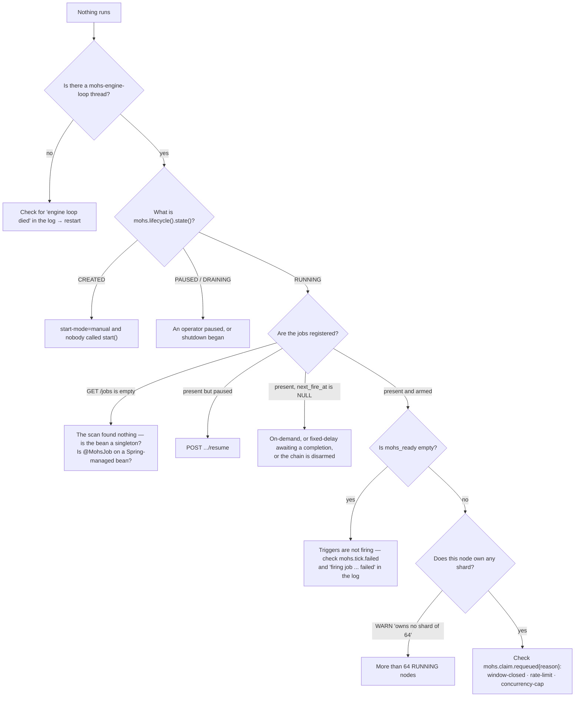

# Troubleshooting

Status: Active · Last Reviewed: 2026-09-05 · Source of Truth: Repository

Symptom-first. For a known task, use the [runbook](runbook.md).

## Boot failures

| Symptom | Cause | Fix |
| --- | --- | --- |
| `mohs.jdbc.dialect must be set (h2, postgresql, mysql or sqlserver)` | The one mandatory property | Set it. It is never auto-detected |
| `duplicate job id 'X' — A#m and B#n both declare it` | Two `@MohsJob` methods share an id | Rename one. An identity conflict **always** fails, unconditionally |
| `... declares more than one job annotation` | `@MohsJob` plus a stereotype, directly or through a composition | Keep one. **A method is exactly one job** |
| `@MohsJob method X#y supports at most 2 parameters` | An unsupported handler signature | At most one payload and one `JobContext`, in any order |
| `@RecurringJob(id="X") on Y declares no trigger` | A recurring job with no schedule | Set `cron`+`zone`, `every`, or `everyAfterFinish` — or use `@OnDemandJob` |
| `@OnExecution on X#y declares N parameters …` / `… declares event=E, which is delivered as …` / `… filters BATCH_COMPLETED by job=…` | An `@OnExecution` method that could never be called | Take none or exactly one parameter, of the delivered event type; drop the `job` filter on `BATCH_COMPLETED` — a batch belongs to no single job |
| `no RetryPolicy bean named 'X' — declare one, or drop the …` | A job names a `retryPolicy` bean that does not exist | Declare the bean, or drop the attribute. Silently falling back to `retries` would hide the intent |
| `job annotation on X has a blank id` | A stereotype without `value`/`id` | `@OnDemandJob("my-job")` |
| `@MohsJob id 'X' collides with a PROGRAMMATIC definition` | Both an annotation and a `Mohs.define` claim the same key | Pick one source per job |
| `job 'X' definition diverged from the stored one (on-conflict=fail)` | `on-conflict=fail` and the code changed | Accept the code (`override`), the store (`preserve`), or align them |
| `mohs.engine.node-lease-ttl must be at least 12s, got …` | The node's promise is shorter than one tick can renew | Raise it to 12 s or above, or drop the property and keep the 15 s default. Below the floor the promise expires while the node is alive and its peers reap its running work |
| `mohs.engine.watchdog-timeout (...) must be greater than mohs.engine.node-lease-ttl (...)` | The bound is below node liveness | Raise it. The bound sits **on top of** liveness, it is not a shorter lease |
| `mohs.engine.max-poll-interval (...) must be >= mohs.engine.poll-interval (...)` | Inverted | The ceiling the backoff climbs to, not a second floor |
| `runner 'X' declared more than once: ... and ...` | The same name in `mohs.runners.*` **and** a `@Bean` | Remove one |
| `RunnerRegistry requires a 'io' runner (the default)` | The default runner is missing | Should not happen through the starter, which always provides it |
| `NoSuchBeanDefinitionException` for `Mohs` with `mohs.api.enabled=true` | `MohsAutoConfiguration` was excluded by hand while the API is on | Manually excluding the library's own auto-configuration is unsupported |

## No jobs run at all

Work through this in order:



### A disarmed fixed-delay chain

`next_fire_at IS NULL` on an `INTERVAL` job with `afterFinish=true` is **normal while an occurrence
is in flight**. It is a problem only if it stays `NULL` with nothing running. The cures are: the
completion transaction, the reaper, a cancel of a queued occurrence, and the upsert's heal at boot.

**A restart is the reliable cure** — the upsert rearms a disarmed recurring trigger.

## Jobs run late

| Symptom | Cause | Fix |
| --- | --- | --- |
| Uniformly late by up to ~2 s on a cluster | **The cross-node wake-up gap.** The local hand-off wakes only the JVM that enqueued; other nodes discover work through their poll | Lower `max-poll-interval` |
| Late by up to `poll-interval` on one node | Expected | Lower `poll-interval` |
| Occasionally very late | The node was busy; the claim is bounded by dispatch headroom | Raise `dispatch-concurrency` |
| A recurring job fires in irregular pairs | Was a symptom of the backoff ignoring known deadlines; the trigger cap fixed it | Confirm you are not overriding `poll-interval` above the trigger's own interval |
| A job with `BACKGROUND` priority never runs under load | **Priority starvation — a documented, unmitigated risk** | Raise its priority, or reduce higher-priority load |
| Everything is late after a pause | The resume burst | Expected. See the [runbook](runbook.md#resume-and-the-burst-that-follows) |

## Work runs twice

Duplicates are **within contract** (at-least-once). The question is whether the *rate* is explained:

| Cause | Evidence | Fix |
| --- | --- | --- |
| A node died mid-execution | `mohs.lease.reclaimed{reason="retry"}` | Expected. Make handlers idempotent |
| A node stalled longer than its lease | `grep "node lease expired"` | Raise `node-lease-ttl`, or find the stall (GC, a blocked tick, a saturated database) |
| The clock jumped backwards | `grep "clock moved backwards"` — the line names NTP and `mohs.time.mode` | Fix NTP, or use `mohs.time.mode=database` |
| The shutdown grace exceeds the lease TTL | With a 15 s TTL and a 30 s grace, more than half the drain is uncovered by any heartbeat | Bring the grace closer to the TTL, or accept the window |
| The watchdog released a healthy job | `grep "exceeded mohs.engine.watchdog-timeout"` | Raise the bound above the slowest job |
| A crash inside the group-commit window | Results waiting for the next flush | Expected. The nominal interval is 5 ms, but scheduling and database latency can extend it. `completion-flush-on-every-result=true` removes batching at a throughput cost |

**What duplicates should never do** is complete twice. The fence guarantees a zombie's result is
discarded — asserted by the `SUSPEND` chaos scenario: zero executions with more than one `SUCCEEDED`
attempt.

## Work is lost

| Cause | Evidence | Fix |
| --- | --- | --- |
| **`retries = 0`** | `mohs.lease.reclaimed{reason="attempts_exhausted"}` after a node death | **This is the opt-in to at-most-once.** The default is 1 for exactly this reason |
| The job was retired mid-flight | `reason="job_retired"` | A retired job never reschedules — its rearmed entry would never be claimed |
| A cancel was honoured | `reason="cancelled"` | The operator's order beats the budget |
| An unreadable payload | Terminal `FAILED` with `attemptsExhausted=false` | A corrupt row or a class gone from the classpath. It does not heal by re-reading |
| Someone deleted rows | — | See [data lifecycle](../06-data/data-lifecycle.md#what-must-never-be-deleted-while-it-is-live) |

## Errors from the API

| Status | Meaning | Action |
| --- | --- | --- |
| 400 | Invalid actor header, or a protocol error | Fix the request. The `detail` names the rule |
| 404 on a job | Unknown key — the body carries `nearbyJobKeys` | Check the spelling against the suggestion |
| 404 on a rate limit | It was never declared. **A `PATCH` never creates one** | The `detail` names the property to set |
| 409 on a retry | Not `FAILED`, a retired job, a duplicate, or **a batch member** | The `detail` says which. A batch member is refused permanently |
| 422 | Domain validation | The `detail` is a controlled Mohs validation message; payload conversion failures remain generic |
| 501 | A v1 contract operation with no implementation | Nothing to do |
| **503** | The rate-limit bucket is contended. **Nothing changed** | Retry in a few seconds |
| 500 | Unexpected | The real cause is in the server log, never in the body |

## Database problems

| Symptom | Cause | Fix |
| --- | --- | --- |
| `Could not initialize class *TestSupport` in tests | **Docker is not running** | Start Docker. An environment failure, not a regression |
| Deadlocks on SQL Server | Every node issues the same purge `DELETE` each tick | It is isolated by `runMaintenance` and does not stop the claim. Watch `mohs.tick.failed{step="stale-node-purge"}` |
| Boot refuses with `READ_COMMITTED_SNAPSHOT is OFF` on SQL Server | RCSI is a requirement of the dialect — without it reads block against the claim's locks | Enable RCSI during a planned database maintenance window, following your platform's connection-drain procedure, then restart the application |
| `Msg 1946 ... exceeds the maximum length of 900 bytes` on SQL Server enqueue | The `mohs_idempotency` clustered-key limit | Apply `V8`, which makes the PK `NONCLUSTERED` |
| Slow `GET /overview` | The backlog `COUNT(*)`, not history | Measured ~13.2 ms at a 500 k backlog. Reduce the backlog |
| The idle probe is slow | A large **non-visible** backlog turns it into a sequential scan (5.5 ms at 200 k, 27.5 ms at 1 M) | Expected. Dead tuples make it much worse — check autovacuum |
| Pool exhaustion | Handler, engine and host demand exceed available connections, or the database is slow | Inspect pool acquisition and query latency; reduce concurrency or resize the pool within the database connection budget |
| `V5` migration failed | It refuses to run outside `READ COMMITTED`, or its 2 s `lock_timeout` expired | The message names the cause. Run it by hand in a `READ COMMITTED` session during a window |

## Time and clock problems

| Symptom | Cause | Fix |
| --- | --- | --- |
| `clock skew ... exceeds threshold` | `database` mode, and the app-to-database offset exceeded the threshold | Fix NTP on the application host |
| `clock moved backwards between heartbeats` | A wall-clock regression | The line explains the consequence: peers may declare this node dead and reclaim running work |
| A daily job did not run on the DST spring-forward day | **Deliberate**: a time that does not exist does not fire, and the next occurrence is the following day | An explicit divergence from Quartz. Move the schedule off the gap hour |
| A daily job ran once, not twice, on the DST fall-back day | **Deliberate**: the repetition is suppressed. A loss is worse than a delay, and duplicating a daily close is the worst outcome | Working as intended |
| Cron times look wrong | The zone is mandatory in `CronSpec` and never the JVM default | Check the declared `zone` |
| Timestamps look an hour off | This was a real defect in the `java.sql.Timestamp` path during the DST gap, fixed by the `LocalDateTime` crossing | If seen on a current version, report it |
| `database` mode drifts by a whole number of hours | The delegate's now-query is not stating UTC — the offset is the distance between the JVM's zone and the server's, not a clock difference | Only reachable through a delegate written outside this repository; the four shipped ones are covered by `DatabaseClockZoneTest` |

## The dashboard

| Symptom | Cause | Fix |
| --- | --- | --- |
| Loads but stays empty | `mohs.api.enabled=false` — there is a boot WARN | Enable the API |
| Every call 404s | A non-default `mohs.api.base-path` — the bundle pins the default | Serve at the default, or proxy |
| Frozen on stale data with no error | `grep "overview stream tick died with an Error"` — the periodic task was **cancelled permanently** | Restart the application |
| A shutdown takes 30 s with a dashboard open | The `MohsOverviewStreamLifecycle` phase failed, or a client is stuck in the last `send` (a declared residual case) | The second case is accepted by design |
| More than 64 people cannot connect | The `MAX_SUBSCRIBERS` cap — an amplification guard, not capacity sizing | Expected |

## Shutdown problems

| Symptom | Cause | Fix |
| --- | --- | --- |
| Shutdown takes the whole grace | Handlers are slow, or deaf to the interrupt | Check for `drain grace period ... elapsed` |
| `engine loop did not stop within {}` | A tick is stuck | The message names the degraded mode: the in-flight wait can miss a dispatch, and work may be re-delivered |
| Work re-executes after a clean shutdown | The grace exceeded `node-lease-ttl`, so part of the drain was uncovered | See [startup and shutdown](startup-and-shutdown.md#two-things-the-post-loop-wait-does-not-cover) |
| A pod is killed mid-drain | `terminationGracePeriodSeconds` is too small | Must exceed the drain grace **plus** the web server's phase |
| `completion flusher did not drain within {}` | Results were still in the flusher's buffer | The remaining ones are left to the reaper |

## Collecting evidence

Before opening an issue:

```bash
# 1. Thread dump — is the loop alive?
jcmd <pid> Thread.print | grep -A5 mohs-

# 2. The engine's state, per node
curl https://app/api/mohs/v1/nodes

# 3. Metrics
curl https://app/actuator/metrics/mohs.lease.reclaimed
curl https://app/actuator/metrics/mohs.tick.failed
curl https://app/actuator/metrics/mohs.claim.batch.size

# 4. The relevant WARNs
grep -E "mohs|lease expired|clock moved|owns no shard|tick step" app.log | tail -200
```

```sql
-- 5. The cluster's own view
SELECT node_id, state, last_heartbeat_at, epoch, expires_at > now() AS alive FROM mohs_nodes;
SELECT COUNT(*) AS backlog FROM mohs_ready WHERE visible_at <= now();
SELECT node_id, COUNT(*) AS in_flight FROM mohs_lease GROUP BY node_id;
SELECT job_key, next_fire_at, paused, orphaned, retired FROM mohs_job_definitions;
```

The single most informative artefact is usually the **thread dump**: every Mohs thread is named,
deliberately, for exactly this moment.
